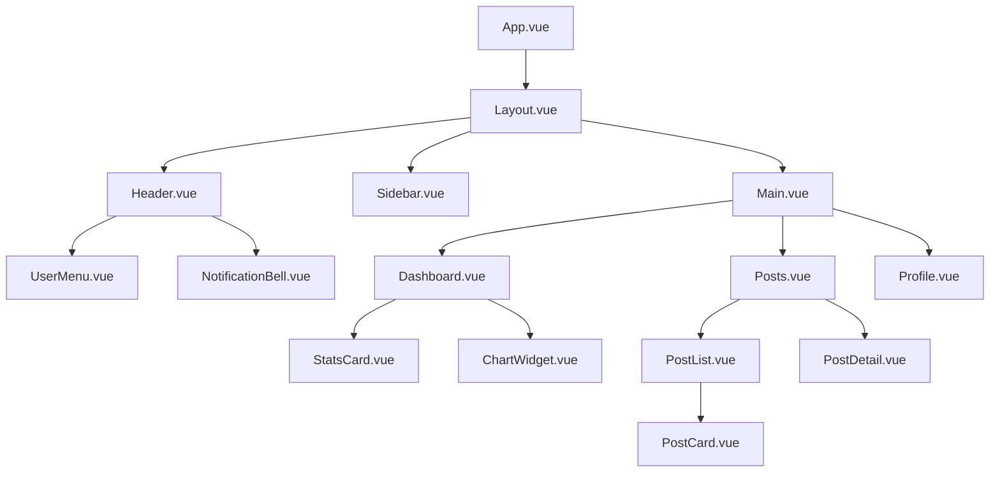

# Analyze Command - 既存システム解析

## 概要
既存のVue.js + ハイブリッド接続プロジェクト（REST API → Supabase → JSONファイル）を体系的に解析し、プロジェクト構造、接続パターン、技術的負債、改善ポイントを明確化します。

## 使用方法
```
/analyze [プロジェクトルートパス]
```

## 実行プロセス

### 1. プロジェクト構造の把握

#### 1.1 基本情報の収集
```bash
# プロジェクトルートの確認
pwd

# package.json の解析
cat package.json | jq '.dependencies, .devDependencies, .scripts'

# ディレクトリ構造の把握
find . -type d -name "node_modules" -prune -o -type d -print | head -50

# ファイル統計
find . -type f -name "*.vue" | wc -l  # Vueファイル数
find . -type f -name "*.js" -o -name "*.ts" | wc -l  # JS/TSファイル数
```

#### 1.2 Vue.js構造の解析
```javascript
// Vueバージョンと構成の確認
const analyzeVueStructure = async () => {
  // Vue 3 の確認
  const isVue3 = await checkFileContent('package.json', '"vue": "^3')
  
  // Composition API vs Options API の使用状況
  const compositionApiUsage = await analyzePattern(
    '**/*.vue',
    /<script setup>|setup\s*\(/
  )
  
  // コンポーネント構造の解析
  const componentStructure = await analyzeComponentHierarchy()
  
  return {
    version: isVue3 ? 'Vue 3' : 'Vue 2',
    apiStyle: compositionApiUsage,
    componentCount: componentStructure.total,
    componentDepth: componentStructure.maxDepth
  }
}
```

### 2. 技術スタック分析

#### 2.1 状態管理の確認
```javascript
// Pinia vs Vuex の判定
const analyzeStateManagement = async () => {
  const hasPinia = await checkDependency('pinia')
  const hasVuex = await checkDependency('vuex')
  
  if (hasPinia) {
    // Piniaストアの解析
    const stores = await findFiles('**/stores/*.js')
    return {
      library: 'Pinia',
      storeCount: stores.length,
      patterns: await analyzePiniaPatterns(stores)
    }
  } else if (hasVuex) {
    // Vuexモジュールの解析
    const modules = await findFiles('**/store/modules/*.js')
    return {
      library: 'Vuex',
      moduleCount: modules.length,
      patterns: await analyzeVuexPatterns(modules)
    }
  }
  
  return { library: 'None', warning: '状態管理ライブラリが見つかりません' }
}
```

#### 2.2 Supabase統合の分析
```javascript
// Supabaseの使用状況確認
const analyzeSupabaseIntegration = async () => {
  const supabaseFiles = await findFiles('**/supabase*.{js,ts}')
  
  const analysis = {
    clientSetup: false,
    authUsage: false,
    databaseUsage: false,
    realtimeUsage: false,
    storageUsage: false,
    rlsPolicies: []
  }
  
  // クライアント設定の確認
  for (const file of supabaseFiles) {
    const content = await readFile(file)
    
    if (content.includes('createClient')) {
      analysis.clientSetup = true
    }
    
    if (content.includes('.auth.')) {
      analysis.authUsage = true
    }
    
    if (content.includes('.from(')) {
      analysis.databaseUsage = true
    }
    
    if (content.includes('.channel(') || content.includes('.on(')) {
      analysis.realtimeUsage = true
    }
    
    if (content.includes('.storage.')) {
      analysis.storageUsage = true
    }
  }
  
  return analysis
}
```

### 3. コンポーネント依存関係の可視化

#### 3.1 コンポーネントマップの生成
```javascript
// コンポーネント間の依存関係を解析
const generateComponentMap = async () => {
  const components = await findFiles('**/*.vue')
  const dependencyMap = new Map()
  
  for (const component of components) {
    const content = await readFile(component)
    const imports = extractComponentImports(content)
    
    dependencyMap.set(component, {
      name: path.basename(component, '.vue'),
      imports: imports,
      props: extractProps(content),
      emits: extractEmits(content),
      slots: extractSlots(content)
    })
  }
  
  return createDependencyGraph(dependencyMap)
}

// Mermaid形式での出力
const createDependencyGraph = (dependencyMap) => {
  let mermaid = 'graph TD\n'
  
  for (const [file, info] of dependencyMap) {
    const componentName = info.name
    
    for (const imp of info.imports) {
      mermaid += `    ${componentName} --> ${imp}\n`
    }
  }
  
  return mermaid
}
```

### 4. コード品質評価

#### 4.1 複雑度分析
```javascript
// 循環的複雑度とコードの重複を検出
const analyzeCodeQuality = async () => {
  const metrics = {
    complexity: [],
    duplications: [],
    largeFiles: [],
    unusedComponents: [],
    deprecatedAPIs: []
  }
  
  // 大きなファイルの検出
  const files = await findFiles('**/*.{vue,js,ts}')
  for (const file of files) {
    const stats = await getFileStats(file)
    
    if (stats.lines > 300) {
      metrics.largeFiles.push({
        file,
        lines: stats.lines,
        recommendation: 'コンポーネントの分割を検討してください'
      })
    }
  }
  
  // 非推奨APIの使用検出
  const deprecatedPatterns = [
    { pattern: /\$set\(/, message: 'Vue 3では不要です' },
    { pattern: /\$delete\(/, message: 'Vue 3では不要です' },
    { pattern: /Vue\.observable/, message: 'reactive()を使用してください' },
    { pattern: /beforeDestroy/, message: 'beforeUnmountを使用してください' },
    { pattern: /destroyed/, message: 'unmountedを使用してください' }
  ]
  
  for (const file of files) {
    const content = await readFile(file)
    
    for (const { pattern, message } of deprecatedPatterns) {
      if (pattern.test(content)) {
        metrics.deprecatedAPIs.push({ file, pattern: pattern.toString(), message })
      }
    }
  }
  
  return metrics
}
```

### 5. パフォーマンス分析

#### 5.1 バンドルサイズ分析
```javascript
// ビルド設定とバンドルサイズの確認
const analyzePerformance = async () => {
  const performance = {
    bundleSize: null,
    lazyLoading: false,
    codeSpitting: false,
    treeShaking: false,
    recommendations: []
  }
  
  // Vite設定の確認
  const viteConfig = await readFile('vite.config.js')
  if (viteConfig) {
    performance.codeSpitting = viteConfig.includes('manualChunks')
    performance.treeShaking = true // Viteはデフォルトで有効
  }
  
  // 遅延読み込みの確認
  const routerFile = await findFiles('**/router/*.js')[0]
  if (routerFile) {
    const routerContent = await readFile(routerFile)
    performance.lazyLoading = routerContent.includes('() => import(')
  }
  
  // 推奨事項の生成
  if (!performance.lazyLoading) {
    performance.recommendations.push('ルートレベルでの遅延読み込みを実装してください')
  }
  
  if (!performance.codeSpitting) {
    performance.recommendations.push('適切なコード分割を設定してください')
  }
  
  return performance
}
```

### 6. セキュリティ監査

#### 6.1 セキュリティパターンの確認
```javascript
// セキュリティの問題点を検出
const performSecurityAudit = async () => {
  const security = {
    issues: [],
    recommendations: [],
    supabaseRLS: false,
    envVariables: false,
    xssProtection: true
  }
  
  // 環境変数の適切な使用確認
  const envUsage = await findPattern('**/*.{js,ts,vue}', /process\.env\.|import\.meta\.env\./)
  security.envVariables = envUsage.length > 0
  
  // Supabase RLSの使用確認
  const supabaseQueries = await findPattern('**/*.{js,ts}', /\.from\(['"]\w+['"]\)/)
  if (supabaseQueries.length > 0) {
    security.recommendations.push('Supabase RLSポリシーが適切に設定されているか確認してください')
  }
  
  // v-htmlの使用確認（XSSリスク）
  const vHtmlUsage = await findPattern('**/*.vue', /v-html/)
  if (vHtmlUsage.length > 0) {
    security.issues.push({
      severity: 'high',
      issue: 'v-htmlの使用はXSSリスクがあります',
      files: vHtmlUsage,
      recommendation: 'DOMPurifyなどでサニタイズを実装してください'
    })
  }
  
  // APIキーの露出確認
  const apiKeyPatterns = [
    /['"][\w-]{20,}['"]/,  // 一般的なAPIキー形式
    /supabase.*key.*['"]\w+['"]/i,  // Supabaseキー
  ]
  
  for (const pattern of apiKeyPatterns) {
    const matches = await findPattern('**/*.{js,ts,vue}', pattern)
    if (matches.length > 0) {
      security.issues.push({
        severity: 'critical',
        issue: 'ハードコードされたAPIキーの可能性があります',
        files: matches,
        recommendation: '環境変数を使用してください'
      })
    }
  }
  
  return security
}
```

### 7. 技術的負債の評価

#### 7.1 技術的負債スコアの計算
```javascript
// 技術的負債を定量化
const calculateTechnicalDebt = (analysis) => {
  let debtScore = 0
  const debtItems = []
  
  // Vue 2使用の場合
  if (analysis.vue.version === 'Vue 2') {
    debtScore += 30
    debtItems.push({
      item: 'Vue 2の使用',
      impact: 'high',
      effort: 'high',
      recommendation: 'Vue 3への移行を計画してください'
    })
  }
  
  // Options API の多用
  if (analysis.vue.apiStyle.optionsApi > 70) {
    debtScore += 20
    debtItems.push({
      item: 'Options APIの多用',
      impact: 'medium',
      effort: 'medium',
      recommendation: 'Composition APIへの段階的移行を検討してください'
    })
  }
  
  // Vuex使用の場合
  if (analysis.stateManagement.library === 'Vuex') {
    debtScore += 15
    debtItems.push({
      item: 'Vuexの使用',
      impact: 'medium',
      effort: 'medium',
      recommendation: 'Piniaへの移行を検討してください'
    })
  }
  
  // 大きなファイル
  if (analysis.codeQuality.largeFiles.length > 5) {
    debtScore += 10 * analysis.codeQuality.largeFiles.length
    debtItems.push({
      item: `${analysis.codeQuality.largeFiles.length}個の大きなファイル`,
      impact: 'medium',
      effort: 'low',
      recommendation: 'コンポーネントの分割を実施してください'
    })
  }
  
  // セキュリティ問題
  analysis.security.issues.forEach(issue => {
    if (issue.severity === 'critical') {
      debtScore += 50
    } else if (issue.severity === 'high') {
      debtScore += 30
    }
    
    debtItems.push({
      item: issue.issue,
      impact: issue.severity,
      effort: 'low',
      recommendation: issue.recommendation
    })
  })
  
  return {
    score: debtScore,
    level: debtScore > 100 ? 'critical' : debtScore > 50 ? 'high' : debtScore > 20 ? 'medium' : 'low',
    items: debtItems
  }
}
```

## 出力形式

### 解析レポート（.tmp/analysis_report.md）
```markdown
# プロジェクト解析レポート

生成日時: 2024-01-15 10:30:00

## エグゼクティブサマリー

- **プロジェクト名**: my-vue-app
- **技術スタック**: Vue 3.4 + Pinia + Supabase
- **コンポーネント数**: 45
- **技術的負債スコア**: 65/200 (Medium)
- **緊急対応項目**: 3件

## 1. プロジェクト構造

### ディレクトリ構成
[ディレクトリツリー]

### ファイル統計
- Vueコンポーネント: 45ファイル
- JavaScript/TypeScript: 78ファイル
- テストファイル: 12ファイル
- 総行数: 8,542行

## 2. 技術スタック分析

### Vue.js
- バージョン: Vue 3.4.21
- API スタイル: Composition API 85%, Options API 15%
- コンポーネント階層: 最大4階層

### 状態管理
- ライブラリ: Pinia
- ストア数: 6
- パターン: Setup Stores使用

### Supabase統合
- ✅ クライアント設定
- ✅ 認証機能
- ✅ データベース操作
- ❌ リアルタイム機能（未使用）
- ✅ ストレージ機能

## 3. コード品質

### 複雑度分析
- 高複雑度ファイル: 3個
- コード重複: 5箇所検出
- 大きなファイル: 8個（300行以上）

### 非推奨API
- beforeDestroy使用: 2箇所
- $set使用: 1箇所

## 4. パフォーマンス

### バンドル最適化
- ✅ コード分割: 実装済み
- ✅ 遅延読み込み: 実装済み
- ❌ 画像最適化: 未実装

### 推奨事項
1. 画像の遅延読み込み実装
2. サードパーティライブラリの見直し

## 5. セキュリティ

### 検出された問題
1. **[CRITICAL]** ハードコードされたAPIキー: 1箇所
2. **[HIGH]** v-htmlの使用: 3箇所

### 推奨対策
1. 環境変数への移行
2. DOMPurifyの導入

## 6. 技術的負債

### 負債スコア: 65/200 (Medium)

### 主要項目
1. Options APIコンポーネント（15%）
2. 大きなファイル（8個）
3. セキュリティ問題（2件）

### 改善ロードマップ
1. **即時対応（1週間）**
   - セキュリティ問題の修正
   
2. **短期（1ヶ月）**
   - 大きなファイルの分割
   - 非推奨APIの置換
   
3. **中期（3ヶ月）**
   - Options APIからComposition APIへの移行
   - パフォーマンス最適化

## 7. 推奨アクション

### 優先度: 高
1. APIキーを環境変数に移行
2. v-htmlのサニタイズ実装
3. 大きなコンポーネントの分割

### 優先度: 中
1. Composition APIへの段階的移行
2. 画像最適化の実装
3. テストカバレッジの向上

### 優先度: 低
1. リアルタイム機能の活用検討
2. コンポーネントライブラリの統一
```

### コンポーネント依存関係図（.tmp/component_map.md）
```markdown
# コンポーネント依存関係マップ



## 使用するコンポーネント

```vue
<!-- AnalysisProgress.vue -->
<template>
  <div class="analysis-progress">
    <h3 class="text-lg font-semibold mb-4">解析進行状況</h3>
    
    <div class="space-y-2">
      <div v-for="step in analysisSteps" :key="step.id" class="flex items-center">
        <div class="w-6 h-6 mr-3">
          <CheckCircleIcon v-if="step.status === 'completed'" class="text-green-500" />
          <ArrowPathIcon v-else-if="step.status === 'in-progress'" class="text-blue-500 animate-spin" />
          <CircleIcon v-else class="text-gray-300" />
        </div>
        
        <div class="flex-1">
          <div class="text-sm font-medium">{{ step.name }}</div>
          <div v-if="step.details" class="text-xs text-gray-500">{{ step.details }}</div>
        </div>
        
        <div v-if="step.status === 'completed'" class="text-xs text-gray-500">
          {{ step.duration }}ms
        </div>
      </div>
    </div>
    
    <div class="mt-4 pt-4 border-t">
      <div class="text-sm text-gray-600">
        総解析時間: {{ totalDuration }}秒
      </div>
    </div>
  </div>
</template>

<script setup>
import { ref, computed } from 'vue'
import { CheckCircleIcon, ArrowPathIcon } from '@heroicons/vue/24/solid'
import { CircleIcon } from '@heroicons/vue/24/outline'

const analysisSteps = ref([
  { id: 1, name: 'プロジェクト構造解析', status: 'completed', duration: 234, details: '45 components found' },
  { id: 2, name: 'Vue.js構成分析', status: 'completed', duration: 156, details: 'Vue 3.4, Composition API 85%' },
  { id: 3, name: 'Supabase統合確認', status: 'in-progress', details: 'Checking auth, database, storage...' },
  { id: 4, name: 'コード品質評価', status: 'pending' },
  { id: 5, name: 'セキュリティ監査', status: 'pending' },
  { id: 6, name: 'レポート生成', status: 'pending' }
])

const totalDuration = computed(() => {
  const completed = analysisSteps.value.filter(s => s.status === 'completed')
  const total = completed.reduce((sum, step) => sum + (step.duration || 0), 0)
  return (total / 1000).toFixed(2)
})
</script>
```

## TodoWrite 連携

解析開始時に以下のタスクを自動生成：

```javascript
const analysisTasks = [
  { 
    id: 'analyze-001',
    content: 'プロジェクト構造の解析',
    status: 'in_progress',
    priority: 'high'
  },
  {
    id: 'analyze-002', 
    content: '技術スタックの分析',
    status: 'pending',
    priority: 'high'
  },
  {
    id: 'analyze-003',
    content: 'コード品質の評価',
    status: 'pending',
    priority: 'medium'
  },
  {
    id: 'analyze-004',
    content: 'セキュリティ監査',
    status: 'pending',
    priority: 'high'
  },
  {
    id: 'analyze-005',
    content: '技術的負債の算出',
    status: 'pending',
    priority: 'medium'
  },
  {
    id: 'analyze-006',
    content: '改善提案の作成',
    status: 'pending',
    priority: 'high'
  }
]
```

## 次のステップ

解析完了後、以下のコマンドが推奨されます：

1. **緊急修正が必要な場合**: `/fix [問題の説明]`
2. **機能追加を計画する場合**: `/enhance [機能の説明]`
3. **リファクタリングを行う場合**: `/refactor`
4. **仕様書を生成する場合**: `/document`
5. **標準化を進める場合**: `/standardize`

## エラーハンドリング

```javascript
// 解析中のエラー処理
const handleAnalysisError = (error, phase) => {
  console.error(`解析エラー (${phase}):`, error)
  
  return {
    phase,
    error: error.message,
    fallback: getFallbackAnalysis(phase),
    recommendation: getErrorRecoverySteps(error, phase)
  }
}

// フォールバック解析の提供
const getFallbackAnalysis = (phase) => {
  const fallbacks = {
    'project-structure': { 
      message: '手動でプロジェクト構造を確認してください',
      commands: ['ls -la', 'tree -L 3 -I node_modules']
    },
    'vue-analysis': {
      message: 'package.jsonを確認してVueバージョンを特定してください',
      commands: ['cat package.json | grep vue']
    },
    'supabase-integration': {
      message: 'Supabase設定ファイルを手動で確認してください',
      commands: ['find . -name "*supabase*" -type f']
    }
  }
  
  return fallbacks[phase] || { message: '手動での確認が必要です' }
}
```

## まとめ

このコマンドは既存のVue.js + REST APIプロジェクトを包括的に解析し、以下を提供します：

1. **現状把握**: プロジェクトの全体像と技術構成
2. **品質評価**: コード品質とセキュリティの問題点
3. **改善提案**: 具体的な改善アクションと優先順位
4. **次のステップ**: 他のコマンドとの連携による継続的改善

解析結果は他のコマンド（enhance, fix, refactor, document, standardize）の基礎データとして活用されます。