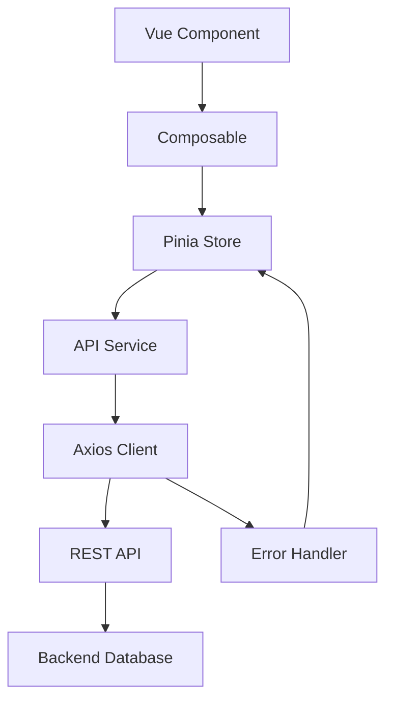

# Design Command - Vue.js + ハイブリッド接続 技術設計

## 概要
要件定義から技術設計を生成し、Vue.js + ハイブリッド接続アーキテクチャ（REST API → Supabase → JSONファイル）に最適化された設計書を作成します。

## 使用方法
```
/design
```

## プロセス

### 1. 要件確認
- requirements.md の内容を読み込み
- 不明点があれば質問
- 設計範囲の確認

### 2. アーキテクチャ設計

#### 2.1 全体構成
```
Frontend (Vue 3 + Vite)
├── Composition API (<script setup>)
├── Pinia Store (状態管理)
├── Vue Router (ルーティング)
├── Hybrid Connection Manager
└── DaisyUI + Tailwind CSS

Hybrid Connection Strategy
├── Primary: REST API (Axios)
├── Fallback: Supabase Client
└── Offline: JSONファイルストレージ
├── JWT Token (認証・認可)
├── Request/Response Interceptors
└── Error Handling & Retry Logic
```

#### 2.2 ディレクトリ構造
```
src/
├── components/       # UIコンポーネント
│   ├── common/      # 共通コンポーネント
│   └── features/    # 機能別コンポーネント
├── composables/     # Composition API ロジック
├── stores/          # Pinia ストア
├── views/           # ページコンポーネント
├── lib/            # ユーティリティ
│   ├── api/        # API クライアント・設定
│   └── utils/      # 共通ユーティリティ
└── types/          # JSDoc 型定義
```

### 3. 技術選定理由

#### Vue.js Composition API
- ロジックの再利用性向上
- JavaScript での型安全性（JSDoc活用）
- リアクティブな状態管理

#### Pinia
- Vue 3 公式推奨
- JavaScript サポート
- DevTools 統合

#### Axios + REST API
- 既存システムとの柔軟な統合
- リクエスト/レスポンス インターセプター
- エラーハンドリングとリトライ機能
- JWT 認証との親和性

#### DaisyUI
- Tailwind CSS ベース
- コンポーネント駆動開発
- テーマシステム

### 4. 設計パターン

#### 4.1 コンポーザブルパターン
```javascript
// composables/useUser.js
import { ref } from 'vue'
import { userService } from '@/services/userService'

/**
 * ユーザー管理用コンポーザブル
 * @returns {Object} ユーザー状態と操作関数
 */
export const useUser = () => {
  /** @type {import('vue').Ref<User|null>} */
  const user = ref(null)
  const loading = ref(false)
  const error = ref(null)
  
  /**
   * ユーザー情報を取得
   * @param {string} id - ユーザーID
   */
  const fetchUser = async (id) => {
    loading.value = true
    error.value = null
    try {
      const userData = await userService.getUser(id)
      user.value = userData
    } finally {
      loading.value = false
    }
  }
  
  return { user, loading, fetchUser }
}
```

#### 4.2 ストアパターン
```javascript
// stores/auth.js
import { defineStore } from 'pinia'
import { ref } from 'vue'
import { authService } from '@/services/authService'

/**
 * 認証ストア
 */
export const useAuthStore = defineStore('auth', () => {
  /** @type {import('vue').Ref<User|null>} */
  const user = ref(null)
  /** @type {import('vue').Ref<string|null>} */
  const accessToken = ref(null)
  /** @type {import('vue').Ref<string|null>} */
  const refreshToken = ref(null)
  
  /**
   * サインイン
   * @param {string} email - メールアドレス
   * @param {string} password - パスワード
   * @returns {Promise<{user: any, tokens: any}>}
   */
  const signIn = async (email, password) => {
    try {
      const response = await authService.login({ email, password })
      user.value = response.user
      accessToken.value = response.access_token
      refreshToken.value = response.refresh_token
      
      // トークンをローカルストレージに保存
      localStorage.setItem('access_token', response.access_token)
      localStorage.setItem('refresh_token', response.refresh_token)
      
      return response
    } catch (error) {
      throw error
    }
  }
  
  /**
   * トークンリフレッシュ
   */
  const refreshAuthToken = async () => {
    if (!refreshToken.value) throw new Error('No refresh token')
    
    const response = await authService.refreshToken(refreshToken.value)
    accessToken.value = response.access_token
    localStorage.setItem('access_token', response.access_token)
    
    return response
  }
  
  /**
   * ログアウト
   */
  const logout = () => {
    user.value = null
    accessToken.value = null
    refreshToken.value = null
    localStorage.removeItem('access_token')
    localStorage.removeItem('refresh_token')
  }
  
  return { 
    user, 
    accessToken, 
    refreshToken,
    signIn, 
    refreshAuthToken,
    logout 
  }
})
```

#### 4.3 API サービス層パターン
```javascript
// services/userService.js
import apiClient from '@/lib/api/client'

export const userService = {
  /**
   * ユーザー一覧取得
   * @param {Object} params - クエリパラメータ
   * @returns {Promise<Object>} ユーザー一覧
   */
  async getUsers(params = {}) {
    const response = await apiClient.get('/users', { params })
    return response.data
  },

  /**
   * ユーザー詳細取得
   * @param {string} id - ユーザーID
   * @returns {Promise<Object>} ユーザー詳細
   */
  async getUser(id) {
    const response = await apiClient.get(`/users/${id}`)
    return response.data
  },

  /**
   * ユーザー作成
   * @param {Object} userData - ユーザーデータ
   * @returns {Promise<Object>} 作成されたユーザー
   */
  async createUser(userData) {
    const response = await apiClient.post('/users', userData)
    return response.data
  }
}
```

#### 4.4 Axios インターセプター設定
```javascript
// lib/api/client.js
import axios from 'axios'
import { useAuthStore } from '@/stores/auth'

const apiClient = axios.create({
  baseURL: import.meta.env.VITE_API_BASE_URL,
  timeout: 10000,
  headers: {
    'Content-Type': 'application/json'
  }
})

// リクエストインターセプター（認証トークン付与）
apiClient.interceptors.request.use(
  (config) => {
    const authStore = useAuthStore()
    if (authStore.accessToken) {
      config.headers.Authorization = `Bearer ${authStore.accessToken}`
    }
    return config
  },
  (error) => Promise.reject(error)
)

// レスポンスインターセプター（エラーハンドリング・トークンリフレッシュ）
apiClient.interceptors.response.use(
  (response) => response,
  async (error) => {
    const authStore = useAuthStore()
    
    if (error.response?.status === 401 && authStore.refreshToken) {
      try {
        await authStore.refreshAuthToken()
        return apiClient(error.config)
      } catch (refreshError) {
        authStore.logout()
        return Promise.reject(refreshError)
      }
    }
    
    return Promise.reject(error)
  }
)

export default apiClient
```

### 5. データフロー設計



### 6. エラーハンドリング戦略

#### 6.1 グローバルエラーハンドラー
```javascript
// plugins/error-handler.js
import { useToast } from '@/composables/useToast'

export default {
  /**
   * Vue アプリケーションにエラーハンドラーを追加
   * @param {import('vue').App} app
   */
  install(app) {
    app.config.errorHandler = (error, instance, info) => {
      console.error('Global error:', error)
      // エラー通知の表示
      useToast().error(error.message)
    }
  }
}
```

#### 6.2 API エラー処理
```javascript
// lib/api/error-handler.js

/**
 * APIエラーを処理してユーザーフレンドリーなメッセージを返す
 * @param {import('axios').AxiosError} error - Axiosエラー
 * @returns {string} エラーメッセージ
 */
export const handleApiError = (error) => {
  if (!error.response) {
    return 'ネットワークエラーが発生しました'
  }
  
  switch (error.response.status) {
    case 400:
      return 'リクエストが正しくありません'
    case 401:
      return '認証が必要です'
    case 403:
      return 'アクセス権限がありません'
    case 404:
      return 'リソースが見つかりません'
    case 422:
      return error.response.data?.message || 'バリデーションエラー'
    case 500:
      return 'サーバーエラーが発生しました'
    default:
      return 'エラーが発生しました'
  }
}
```

### 7. パフォーマンス最適化

#### 7.1 コンポーネント最適化
- `defineAsyncComponent` による遅延読み込み
- `v-memo` による再レンダリング制御
- `shallowRef` による大規模データの最適化

#### 7.2 API 最適化
- リクエストのバッチ処理
- レスポンスキャッシュの活用
- 必要なデータのみリクエスト
- 並列リクエストによる高速化

### 8. セキュリティ設計

#### 8.1 フロントエンド
- 環境変数による機密情報管理
- XSS 対策（v-html の制限）
- CSRF トークンの実装

#### 8.2 API セキュリティ
- JWT トークンの適切な管理
- HTTPS 通信の徹底
- API キーの環境変数管理
- リクエスト・レスポンスの入力値検証

### 9. テスト戦略

#### 9.1 単体テスト
- Vitest によるコンポーネントテスト
- Pinia ストアのモックテスト
- コンポーザブルのテスト

#### 9.2 統合テスト
- モック API を使用したテスト
- ネットワークレイヤーのテスト
- E2E テスト（Playwright）

### 10. デプロイメント設計

#### 10.1 フロントエンド
- Vercel / Netlify デプロイ
- 環境別ビルド設定
- CDN 最適化

#### 10.2 Supabase
- 環境別プロジェクト
- マイグレーション管理
- バックアップ戦略

## 出力形式

設計完了後、以下のファイルを生成：

1. `.cckiro/specs/[機能名]/design.md` - 技術設計書
2. `.cckiro/specs/[機能名]/architecture.md` - アーキテクチャ図
3. `.cckiro/specs/[機能名]/data-flow.md` - データフロー設計

## TodoWrite 連携

設計フェーズの主要タスクを自動的に TodoWrite に登録：
- [ ] アーキテクチャ設計
- [ ] データモデル設計
- [ ] API 設計
- [ ] セキュリティ設計
- [ ] パフォーマンス設計

## 次のステップ

設計承認後、`/tasks` コマンドで詳細タスク分割へ進む。