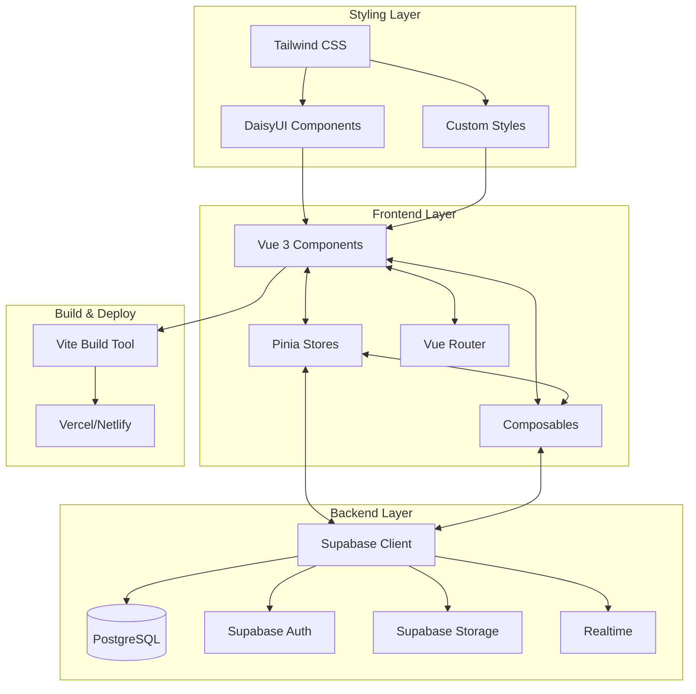
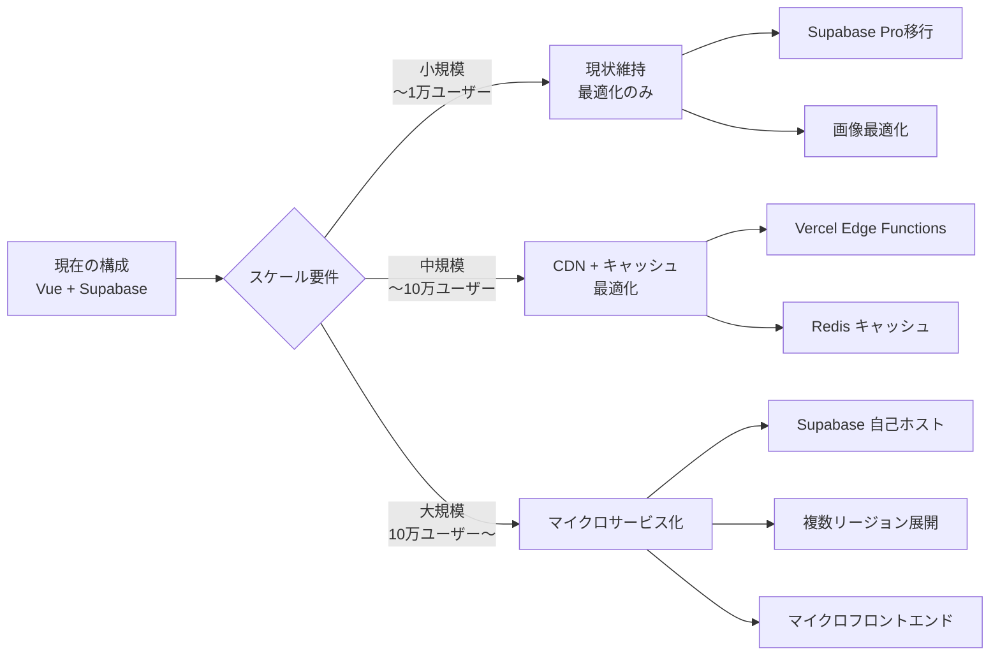

# 技術スタックガイドライン - テンプレート

> **🛠️ このドキュメントについて**  
> このドキュメントはVue.js + Supabase技術スタックの汎用ガイドラインです。  
> プロジェクト固有の要件がある場合は、該当セクションを調整してご利用ください。

## 目次
1. [技術スタック概要](#1-技術スタック概要)
2. [技術選定の理由](#2-技術選定の理由)
3. [技術スタック間の連携](#3-技術スタック間の連携)
4. [バージョン管理方針](#4-バージョン管理方針)
5. [開発環境の統一](#5-開発環境の統一)
6. [パフォーマンス最適化方針](#6-パフォーマンス最適化方針)
7. [セキュリティ方針](#7-セキュリティ方針)
8. [技術的負債の管理](#8-技術的負債の管理)
9. [将来の拡張性](#9-将来の拡張性)
10. [トラブルシューティング](#10-トラブルシューティング)

---

## 1. 技術スタック概要

### 🔴 必須：コア技術スタック（2024年推奨版）

#### フロントエンド
```javascript
// package.json の推奨依存関係（最新安定版）
{
  "dependencies": {
    "vue": "^3.4.21",                   // UIフレームワーク
    "vue-router": "^4.3.0",             // ルーティング
    "pinia": "^2.1.7",                  // 状態管理
    "@supabase/supabase-js": "^2.39.8", // Supabaseクライアント
    "@vueuse/core": "^10.9.0"           // Composition APIユーティリティ
  },
  "devDependencies": {
    "vite": "^5.1.4",                   // ビルドツール
    "tailwindcss": "^3.4.1",            // CSSフレームワーク
    "daisyui": "^4.7.2",                // UIコンポーネント
    "@vitejs/plugin-vue": "^5.0.4",     // Vite Vueプラグイン
    "vitest": "^1.3.1",                 // テストフレームワーク
    "@vue/test-utils": "^2.4.4",        // Vueテストユーティリティ
    "eslint": "^8.57.0",                // リンター
    "prettier": "^3.2.5"                // フォーマッター
  }
}
```

#### バックエンド・インフラ
```yaml
Supabase (推奨構成):
  - Database: PostgreSQL 15.x
  - Authentication: Supabase Auth (JWT)
  - Storage: Supabase Storage
  - Realtime: PostgreSQL Realtime
  - Edge Functions: Deno Runtime

Hosting (推奨オプション):
  - Frontend: Vercel / Netlify
  - Backend: Supabase Cloud
  - CDN: 自動設定（ホスティングサービス付属）
  - Domain: お名前.com / Cloudflare
```

### 🟡 推奨：追加ライブラリ
```javascript
// 必要に応じて追加する便利ライブラリ
{
  "dependencies": {
    // フォーム処理
    "@vuelidate/core": "^2.0.3",        // バリデーション
    "@vuelidate/validators": "^2.0.4",   // バリデータ
    
    // 日付処理
    "dayjs": "^1.11.10",                 // 軽量日付ライブラリ
    
    // アイコン
    "@heroicons/vue": "^2.1.1",         // Heroiconsアイコン
    
    // ユーティリティ
    "lodash-es": "^4.17.21",             // ユーティリティ関数
    
    // 通知・トースト
    "vue-toastification": "^2.0.0-rc.5", // 通知システム
  },
  "devDependencies": {
    // 開発効率化
    "unplugin-auto-import": "^0.17.5",   // 自動インポート
    "unplugin-vue-components": "^0.26.0" // コンポーネント自動登録
  }
}
```

---

## 2. 技術選定の理由

### Vue.js 3 を選ぶべき理由

#### ✅ 利点
```vue
<!-- 1. Composition API による優れた開発体験 -->
<script setup>
// シンプルで直感的な記法
import { ref, computed } from 'vue'

const count = ref(0)
const doubled = computed(() => count.value * 2)

// TypeScriptライクな型推論（JSDocでも対応可能）
/** @type {import('vue').Ref<string>} */
const message = ref('Hello Vue 3')
</script>
```

```typescript
// 2. 優れたパフォーマンス特性
const performanceFeatures = {
  virtualDOM: "最適化されたVirtual DOM",
  bundleSize: "約34KB（gzipped）",
  treeShaking: "未使用コードの自動除去",
  reactivity: "Proxyベースの効率的なリアクティビティ",
  ssr: "優秀なSSR/SSG対応"
}
```

```javascript
// 3. 段階的導入が可能
const adoptionStrategy = {
  migration: "既存プロジェクトへの部分的導入可能",
  learning: "Reactより緩やかな学習曲線",
  ecosystem: "主要ライブラリは充実",
  community: "活発な日本語コミュニティ"
}
```

#### ⚠️ 注意点と対策
| 注意点 | 対策 |
|--------|------|
| Reactより生態系が小さい | VueUse等で主要機能をカバー、必要に応じて自作 |
| エンタープライズ事例が相対的に少ない | 豊富なドキュメントとコミュニティサポートで補完 |
| TypeScript統合が発展途上 | JSDoc + Volarで型安全性を確保 |

### Pinia を選ぶべき理由

#### ✅ 利点
```javascript
// stores/counter.js - シンプルで直感的なストア定義
import { defineStore } from 'pinia'
import { ref, computed } from 'vue'

export const useCounterStore = defineStore('counter', () => {
  // State
  const count = ref(0)
  
  // Getters  
  const doubleCount = computed(() => count.value * 2)
  
  // Actions
  function increment() {
    count.value++
  }
  
  return { count, doubleCount, increment }
})
```

```javascript
// stores/user.js - Supabase連携の例
import { defineStore } from 'pinia'
import { supabase } from '@/lib/supabase'

export const useUserStore = defineStore('user', () => {
  const user = ref(null)
  const loading = ref(true)
  const isAuthenticated = computed(() => !!user.value)
  
  async function signIn({ email, password }) {
    try {
      const { data, error } = await supabase.auth.signInWithPassword({
        email, password
      })
      if (error) throw error
      user.value = data.user
      return { success: true }
    } catch (error) {
      return { success: false, error: error.message }
    }
  }
  
  return { user, loading, isAuthenticated, signIn }
})
```

#### Vuex との比較
| 項目 | Pinia | Vuex 4 |
|------|-------|--------|
| 構文 | Composition API ネイティブ | Options API 中心 |
| TypeScript | 優秀な型推論 | 複雑な設定が必要 |
| DevTools | フル対応 | フル対応 |
| バンドルサイズ | 軽量 | やや重い |
| 学習コスト | 低い | 中程度 |

### Supabase を選ぶべき理由

#### ✅ 利点
```javascript
// 1. オールインワンソリューション
// lib/supabase.js
import { createClient } from '@supabase/supabase-js'

const supabase = createClient(
  import.meta.env.VITE_SUPABASE_URL,
  import.meta.env.VITE_SUPABASE_ANON_KEY
)

// 認証、DB、ストレージ、リアルタイムが統合されている
export { supabase }
```

```sql
-- 2. Row Level Security (RLS) による強力なセキュリティ
-- ユーザーは自分のデータのみアクセス可能
CREATE POLICY "Users can manage own todos" ON todos
  FOR ALL USING (auth.uid() = user_id);

-- 管理者のみ全データアクセス可能  
CREATE POLICY "Admins can manage all todos" ON todos
  FOR ALL USING (
    auth.jwt() ->> 'role' = 'admin'
  );
```

```javascript
// 3. リアルタイム機能の簡単実装
// composables/useRealtime.js
import { ref, onMounted, onUnmounted } from 'vue'
import { supabase } from '@/lib/supabase'

export function useRealtimeTable(tableName) {
  const data = ref([])
  let subscription = null
  
  onMounted(() => {
    // 初期データ取得
    loadInitialData()
    
    // リアルタイム購読開始
    subscription = supabase
      .channel(`${tableName}_changes`)
      .on('postgres_changes', 
        { event: '*', schema: 'public', table: tableName },
        handleChange
      )
      .subscribe()
  })
  
  onUnmounted(() => {
    if (subscription) {
      subscription.unsubscribe()
    }
  })
  
  function handleChange(payload) {
    // INSERT, UPDATE, DELETE を自動反映
    switch (payload.eventType) {
      case 'INSERT':
        data.value.push(payload.new)
        break
      case 'UPDATE':
        const index = data.value.findIndex(item => item.id === payload.new.id)
        if (index >= 0) data.value[index] = payload.new
        break
      case 'DELETE':
        data.value = data.value.filter(item => item.id !== payload.old.id)
        break
    }
  }
  
  async function loadInitialData() {
    const { data: initialData } = await supabase
      .from(tableName)
      .select('*')
    data.value = initialData || []
  }
  
  return { data }
}
```

#### 🔄 Supabase 料金プラン（2024年版）
| プラン | 月額（USD） | データベース | ストレージ | 認証ユーザー | 適用場面 |
|-------|-----------|-------------|-----------|-------------|----------|
| **Free** | $0 | 500MB | 1GB | 50,000 | 開発・プロトタイプ |
| **Pro** | $25 | 8GB | 100GB | 100,000 | 小〜中規模サービス |
| **Team** | $599 | 無制限 | 無制限 | 無制限 | エンタープライズ |

#### 他のBaaSとの比較
| 機能 | Supabase | Firebase | AWS Amplify |
|------|----------|----------|-------------|
| データベース | PostgreSQL (SQL) | Firestore (NoSQL) | DynamoDB (NoSQL) |
| 料金体系 | 予測可能な固定費 | 従量課金制 | 従量課金制 |
| オープンソース | ✓ | ✗ | 部分的 |
| セルフホスト | ✓ | ✗ | ✗ |
| 学習コスト | 中（SQL知識必要） | 低 | 高 |
| リアルタイム | 標準搭載 | 標準搭載 | 別途設定必要 |

### Tailwind CSS + DaisyUI を選ぶべき理由

#### ✅ 利点
```vue
<!-- 1. ユーティリティファーストによる高速開発 -->
<template>
  <!-- DaisyUIコンポーネント + Tailwindユーティリティの組み合わせ -->
  <div class="card bg-base-100 shadow-xl hover:shadow-2xl transition-all duration-300">
    <figure class="px-6 pt-6">
      
    </figure>
    <div class="card-body">
      <h2 class="card-title text-2xl font-bold text-primary">
        製品名
        <div class="badge badge-secondary">NEW</div>
      </h2>
      <p class="text-base-content/70 leading-relaxed">
        製品の説明文がここに入ります。
      </p>
      <div class="card-actions justify-end mt-4">
        <button class="btn btn-primary btn-sm gap-2">
          <svg class="w-4 h-4" fill="currentColor" viewBox="0 0 20 20">
            <!-- アイコン -->
          </svg>
          購入する
        </button>
      </div>
    </div>
  </div>
</template>
```

```javascript
// 2. テーマシステムによる一貫したデザイン
// tailwind.config.js
module.exports = {
  content: ['./index.html', './src/**/*.{vue,js,ts}'],
  theme: {
    extend: {
      // カスタムカラーの追加
      colors: {
        brand: {
          50: '#f0f9ff',
          500: '#3b82f6',
          900: '#1e3a8a'
        }
      }
    }
  },
  plugins: [require('daisyui')],
  daisyui: {
    themes: [
      'light',
      'dark',
      'cupcake',
      'corporate',
      // カスタムテーマ
      {
        mytheme: {
          primary: '#3b82f6',
          secondary: '#f59e0b',
          accent: '#10b981',
          neutral: '#374151',
          'base-100': '#ffffff',
        }
      }
    ]
  }
}
```

#### 他のUIライブラリとの比較
| ライブラリ | 利点 | 欠点 | Vue.js適性 | 選定理由 |
|-----------|------|------|-----------|---------|
| **Tailwind + DaisyUI** | 軽量、高カスタマイズ性 | 学習コスト | ✓ 高 | **採用** |
| Vuetify | Vue特化、豊富なコンポーネント | 重い、Material Design固定 | ✓ 高 | 柔軟性に欠ける |
| Element Plus | エンタープライズ向け、多機能 | デザインが固定的 | ✓ 中 | カスタマイズ困難 |
| Ant Design Vue | 機能豊富、企業実績 | バンドルサイズ大 | ✓ 中 | パフォーマンス懸念 |
| Headless UI + 自作CSS | 完全制御可能 | 開発コスト高 | ✓ 中 | 工数過大 |

### Vite を選ぶべき理由

#### ✅ 利点
```javascript
// vite.config.js - 最適化設定例
import { defineConfig } from 'vite'
import vue from '@vitejs/plugin-vue'
import { resolve } from 'path'

export default defineConfig({
  plugins: [vue()],
  
  // 開発サーバー設定
  server: {
    hmr: true,              // 高速ホットリロード
    port: 3000,
    open: true              // ブラウザ自動起動
  },
  
  // ビルド最適化
  build: {
    target: 'es2020',
    rollupOptions: {
      output: {
        manualChunks: {
          'vendor': ['vue', 'vue-router', 'pinia'],
          'supabase': ['@supabase/supabase-js'],
          'ui': ['@vueuse/core']
        }
      }
    },
    // 本番での最適化
    minify: 'terser',
    terserOptions: {
      compress: {
        drop_console: true,
        drop_debugger: true
      }
    }
  },
  
  // パス解決
  resolve: {
    alias: {
      '@': resolve(__dirname, 'src'),
      '@components': resolve(__dirname, 'src/components'),
      '@stores': resolve(__dirname, 'src/stores')
    }
  }
})
```

#### Webpack との比較
| 項目 | Vite | Webpack 5 |
|------|------|-----------|
| 開発サーバー起動 | < 1秒 | 5-30秒 |
| HMR速度 | 即座 | 1-5秒 |
| 設定の複雑さ | シンプル | 複雑 |
| プラグインエコシステム | 成長中 | 成熟 |
| Vue.js最適化 | ネイティブ対応 | 追加設定必要 |

---

## 3. 技術スタック間の連携

### 🔴 必須：統合アーキテクチャ



### 実装例：認証フロー統合
```javascript
// stores/auth.js - 統合認証ストア
import { defineStore } from 'pinia'
import { ref, computed } from 'vue'
import { supabase } from '@/lib/supabase'

export const useAuthStore = defineStore('auth', () => {
  // State
  const user = ref(null)
  const session = ref(null)
  const loading = ref(true)
  
  // Getters
  const isAuthenticated = computed(() => !!user.value)
  const userRole = computed(() => user.value?.user_metadata?.role || 'user')
  
  // Actions
  async function initialize() {
    try {
      // セッション復元
      const { data: { session: currentSession } } = await supabase.auth.getSession()
      
      if (currentSession) {
        session.value = currentSession
        user.value = currentSession.user
      }
      
      // 認証状態変更の監視
      supabase.auth.onAuthStateChange((event, newSession) => {
        session.value = newSession
        user.value = newSession?.user ?? null
        
        // ページリロード時の処理
        if (event === 'SIGNED_IN') {
          // ユーザー情報を取得・更新
          fetchUserProfile()
        }
      })
    } catch (error) {
      console.error('認証初期化エラー:', error)
    } finally {
      loading.value = false
    }
  }
  
  async function signIn({ email, password }) {
    try {
      const { data, error } = await supabase.auth.signInWithPassword({
        email,
        password
      })
      
      if (error) throw error
      
      return { success: true, data }
    } catch (error) {
      return { success: false, error: error.message }
    }
  }
  
  async function signOut() {
    try {
      const { error } = await supabase.auth.signOut()
      if (error) throw error
      
      // ローカル状態をクリア
      user.value = null
      session.value = null
      
      return { success: true }
    } catch (error) {
      return { success: false, error: error.message }
    }
  }
  
  async function fetchUserProfile() {
    if (!user.value) return
    
    try {
      const { data, error } = await supabase
        .from('profiles')
        .select('*')
        .eq('id', user.value.id)
        .single()
      
      if (error) throw error
      
      // ユーザー情報を拡張
      user.value = { ...user.value, profile: data }
    } catch (error) {
      console.error('プロフィール取得エラー:', error)
    }
  }
  
  return {
    // State
    user: readonly(user),
    session: readonly(session),
    loading: readonly(loading),
    
    // Getters
    isAuthenticated,
    userRole,
    
    // Actions
    initialize,
    signIn,
    signOut,
    fetchUserProfile
  }
})
```

```vue
<!-- components/AuthGuard.vue - ルーターガード統合 -->
<script setup>
import { watch, onMounted } from 'vue'
import { useRouter } from 'vue-router'
import { useAuthStore } from '@/stores/auth'

const props = defineProps({
  requireAuth: {
    type: Boolean,
    default: true
  },
  allowedRoles: {
    type: Array,
    default: () => ['user', 'admin']
  }
})

const router = useRouter()
const authStore = useAuthStore()

onMounted(() => {
  checkAuthStatus()
})

watch(
  () => authStore.loading,
  (loading) => {
    if (!loading) {
      checkAuthStatus()
    }
  }
)

function checkAuthStatus() {
  if (props.requireAuth) {
    if (!authStore.isAuthenticated) {
      router.push('/login')
      return
    }
    
    if (props.allowedRoles.length > 0) {
      if (!props.allowedRoles.includes(authStore.userRole)) {
        router.push('/unauthorized')
        return
      }
    }
  }
}
</script>

<template>
  <div v-if="!authStore.loading">
    <div v-if="!props.requireAuth || authStore.isAuthenticated">
      <slot />
    </div>
    <div v-else class="flex items-center justify-center min-h-screen">
      <div class="text-center">
        <div class="loading loading-spinner loading-lg"></div>
        <p class="mt-4">認証確認中...</p>
      </div>
    </div>
  </div>
</template>
```

---

## 4. バージョン管理方針

### 🔴 必須：セマンティックバージョニング

```json
{
  "version": "1.2.3",
  // MAJOR.MINOR.PATCH
  // MAJOR: 破壊的変更（Vue 2 → 3 等）
  // MINOR: 機能追加（後方互換性あり）
  // PATCH: バグ修正
}
```

### 依存関係更新戦略
```javascript
// package.json での適切なバージョン指定
{
  "dependencies": {
    // 固定バージョン（重要なライブラリ）
    "vue": "3.4.21",
    
    // パッチ更新のみ許可（安定性重視）
    "vue-router": "~4.3.0",
    
    // マイナー更新まで許可（機能追加対応）
    "@supabase/supabase-js": "^2.39.0",
    
    // 最新版追従（開発ツール）
    "@vueuse/core": "*"
  }
}
```

### 🟡 推奨：更新スケジュール
| パッケージカテゴリ | 更新頻度 | 理由 | チェック方法 |
|------------------|---------|------|-------------|
| Vue Core | メジャー: 半年〜1年 | 破壊的変更の影響大 | 公式移行ガイド確認 |
| Supabase | マイナー: 月1回 | セキュリティ更新重要 | リリースノート確認 |
| Vite | マイナー: 2週間 | パフォーマンス改善 | `npm outdated` |
| DaisyUI | メジャー: 3ヶ月 | デザイン一貫性維持 | 変更ログ確認 |
| 開発ツール | 随時 | 生産性向上 | 自動更新可 |

```bash
# 定期的な依存関係チェックコマンド
npm outdated                    # 古いパッケージ確認
npm audit                      # セキュリティ脆弱性確認  
npm audit fix                  # 自動修正可能な脆弱性修正
npx updates -u                 # インタラクティブ更新
```

---

## 5. 開発環境の統一

### 🔴 必須：必須ツール一覧

#### エディタ設定
```json
// .vscode/settings.json
{
  "editor.formatOnSave": true,
  "editor.codeActionsOnSave": {
    "source.fixAll.eslint": true
  },
  "eslint.validate": ["vue", "javascript", "typescript"],
  "vue.codeActions.enabled": true,
  "tailwindCSS.includeLanguages": {
    "vue": "html"
  },
  "tailwindCSS.experimental.classRegex": [
    ["class\\s*:\\s*['\"`]([^'\"`]*)['\"`]", "[\"'`]([^\"'`]*).*?[\"'`]"]
  ]
}
```

```json
// .vscode/extensions.json
{
  "recommendations": [
    "Vue.volar",                    // Vue 3 公式拡張
    "bradlc.vscode-tailwindcss",    // Tailwind CSS IntelliSense
    "esbenp.prettier-vscode",       // Prettier
    "dbaeumer.vscode-eslint",       // ESLint
    "supabase.supabase-vscode",     // Supabase 統合
    "antfu.iconify"                 // アイコン表示
  ]
}
```

#### Node.js 環境
```bash
# .nvmrc - Node.jsバージョン固定
18.19.0

# package.json - engines指定
{
  "engines": {
    "node": ">=18.0.0",
    "npm": ">=9.0.0"
  }
}
```

### 環境セットアップ自動化
```bash
#!/bin/bash
# scripts/setup.sh - 開発環境自動セットアップ

echo "🚀 Vue.js + Supabase 開発環境セットアップ開始"

# Node.jsバージョン確認
required_node="18"
current_node=$(node -v | cut -d'.' -f1 | sed 's/v//')

if [ "$current_node" -lt "$required_node" ]; then
  echo "❌ Node.js 18以上が必要です。現在: $(node -v)"
  echo "💡 nvm install 18 && nvm use 18 を実行してください"
  exit 1
fi

echo "✅ Node.js バージョン: $(node -v)"

# 依存関係インストール
echo "📦 依存関係をインストール中..."
npm ci

# 環境変数設定
if [ ! -f .env.local ]; then
  echo "🔧 環境変数ファイルを作成中..."
  cp .env.example .env.local
  echo "⚠️  .env.local ファイルを編集してSupabaseの設定を追加してください"
fi

# Git hooks セットアップ
if [ -d .git ]; then
  echo "🪝 Git hooks をセットアップ中..."
  npx husky install
fi

# VSCodeワークスペース設定確認
if [ ! -d .vscode ]; then
  echo "📝 VSCode設定を作成中..."
  mkdir -p .vscode
  # settings.json, extensions.json をコピー
fi

echo "🎉 セットアップ完了！"
echo ""
echo "次のステップ:"
echo "1. .env.local ファイルを編集"
echo "2. npm run dev で開発サーバー起動"
echo "3. http://localhost:3000 でアプリ確認"
```

---

## 6. パフォーマンス最適化方針

### 🔴 必須：フロントエンド最適化

#### Vite ビルド最適化
```javascript
// vite.config.js - 本番最適化
import { defineConfig } from 'vite'
import vue from '@vitejs/plugin-vue'
import { visualizer } from 'rollup-plugin-visualizer'

export default defineConfig({
  plugins: [
    vue(),
    // バンドル分析（開発時のみ）
    process.env.ANALYZE && visualizer({
      filename: 'dist/stats.html',
      open: true
    })
  ],
  
  build: {
    // 最小ターゲット設定
    target: 'es2020',
    
    // チャンク分割最適化
    rollupOptions: {
      output: {
        manualChunks: {
          // ベンダーライブラリ分離
          'vue-vendor': ['vue', 'vue-router', 'pinia'],
          'supabase-vendor': ['@supabase/supabase-js'],
          'utils-vendor': ['@vueuse/core'],
          
          // 大きなライブラリは個別分離
          'charts': ['chart.js'], // 例: チャートライブラリ
        },
        
        // ファイル名にハッシュ付与（キャッシュ戦略）
        chunkFileNames: 'js/[name]-[hash].js',
        entryFileNames: 'js/[name]-[hash].js',
        assetFileNames: 'assets/[name]-[hash].[ext]'
      }
    },
    
    // 圧縮設定
    minify: 'terser',
    terserOptions: {
      compress: {
        drop_console: true,    // console.log削除
        drop_debugger: true,   // debugger削除
        pure_funcs: ['console.info', 'console.debug']
      }
    },
    
    // 警告表示制限
    chunkSizeWarningLimit: 1000
  },
  
  // CSS最適化
  css: {
    devSourcemap: true,
    preprocessorOptions: {
      // Tailwind CSS最適化
      postcss: {
        plugins: [
          require('tailwindcss'),
          require('autoprefixer'),
          // 本番環境でCSS圧縮
          ...(process.env.NODE_ENV === 'production' 
            ? [require('cssnano')] 
            : [])
        ]
      }
    }
  }
})
```

#### Vue.js パフォーマンス最適化
```vue
<!-- コンポーネント最適化例 -->
<script setup>
import { ref, computed, defineAsyncComponent } from 'vue'

// 重いコンポーネントの遅延読み込み
const HeavyChart = defineAsyncComponent(() => 
  import('./components/HeavyChart.vue')
)

// リアクティビティ最適化
const items = ref([])
const searchQuery = ref('')

// 計算プロパティでパフォーマンス向上
const filteredItems = computed(() => {
  if (!searchQuery.value) return items.value
  
  return items.value.filter(item => 
    item.name.toLowerCase().includes(searchQuery.value.toLowerCase())
  )
})

// メモリリーク防止
import { onUnmounted } from 'vue'
let timer = null

onUnmounted(() => {
  if (timer) {
    clearInterval(timer)
  }
})
</script>

<template>
  <div>
    <!-- 条件付きレンダリング最適化 -->
    <template v-if="filteredItems.length > 0">
      <!-- v-for最適化（key必須） -->
      <div 
        v-for="item in filteredItems" 
        :key="item.id"
        class="item"
      >
        {{ item.name }}
      </div>
    </template>
    
    <!-- 遅延ロードコンポーネント -->
    <Suspense v-if="showChart">
      <template #default>
        <HeavyChart :data="chartData" />
      </template>
      <template #fallback>
        <div class="loading loading-spinner"></div>
      </template>
    </Suspense>
  </div>
</template>
```

### 🟡 推奨：Supabase 最適化

#### クエリ最適化
```javascript
// ❌ 悪い例：N+1クエリ
async function getBadPosts() {
  const { data: posts } = await supabase
    .from('posts')
    .select('*')
  
  // 各投稿の作者を個別に取得（N+1問題）
  for (const post of posts) {
    const { data: author } = await supabase
      .from('users')
      .select('name')
      .eq('id', post.author_id)
      .single()
    post.author = author
  }
  
  return posts
}

// ✅ 良い例：JOIN で一度に取得
async function getOptimizedPosts() {
  const { data: posts } = await supabase
    .from('posts')
    .select(`
      *,
      author:users(name, avatar_url)
    `)
    .order('created_at', { ascending: false })
    .limit(20)
  
  return posts
}

// ✅ さらに良い例：ページネーション付き
async function getPaginatedPosts(page = 1, limit = 10) {
  const from = (page - 1) * limit
  const to = from + limit - 1
  
  const { data: posts, count } = await supabase
    .from('posts')
    .select(`
      *,
      author:users(name, avatar_url),
      comments(count)
    `, { count: 'exact' })
    .order('created_at', { ascending: false })
    .range(from, to)
  
  return {
    posts,
    totalCount: count,
    hasMore: count > to + 1
  }
}
```

#### インデックス戦略
```sql
-- パフォーマンス向上のためのインデックス例

-- 頻繁に検索されるカラム
CREATE INDEX idx_posts_author_id ON posts(author_id);
CREATE INDEX idx_posts_created_at ON posts(created_at DESC);

-- 複合インデックス（検索条件が複数の場合）
CREATE INDEX idx_posts_status_created ON posts(status, created_at DESC);

-- 部分インデックス（条件付きインデックス）
CREATE INDEX idx_posts_published ON posts(created_at DESC) 
WHERE status = 'published';

-- 全文検索インデックス（PostgreSQL固有）
CREATE INDEX idx_posts_search ON posts 
USING GIN(to_tsvector('japanese', title || ' ' || content));
```

---

## 7. セキュリティ方針

### 🔴 必須：フロントエンドセキュリティ

#### 環境変数管理
```javascript
// ❌ 悪い例：秘密情報をコードに直接記述
const apiKey = 'sk_secret_key_1234567890'  // 絶対NG！

// ✅ 良い例：環境変数の適切な使用
// .env.local（ローカル開発用）
VITE_SUPABASE_URL=https://your-project.supabase.co
VITE_SUPABASE_ANON_KEY=eyJ0eXAiOiJKV1QiLCJhbGciOiJI...

// .env.production（本番用 - Vercel等で設定）
VITE_SUPABASE_URL=https://your-prod-project.supabase.co
VITE_SUPABASE_ANON_KEY=eyJ0eXAiOiJKV1QiLCJhbGciOiJI...

// 秘密鍵（サーバーサイドのみ）
SUPABASE_SERVICE_KEY=eyJ0eXAiOiJKV1QiLCJhbGciOiJI...  // フロントエンドでは使用禁止
```

```javascript
// lib/supabase.js - 安全な初期化
import { createClient } from '@supabase/supabase-js'

const supabaseUrl = import.meta.env.VITE_SUPABASE_URL
const supabaseAnonKey = import.meta.env.VITE_SUPABASE_ANON_KEY

if (!supabaseUrl || !supabaseAnonKey) {
  throw new Error('Supabase環境変数が設定されていません')
}

export const supabase = createClient(supabaseUrl, supabaseAnonKey, {
  auth: {
    autoRefreshToken: true,
    persistSession: true,
    detectSessionInUrl: true
  }
})
```

#### XSS対策
```vue
<!-- XSS対策の実装例 -->
<script setup>
import { ref, computed } from 'vue'
import DOMPurify from 'dompurify'

const userInput = ref('')
const userContent = ref('<script>alert("XSS")</script><p>正常なコンテンツ</p>')

// HTMLをサニタイズして安全に表示
const sanitizedContent = computed(() => {
  return DOMPurify.sanitize(userContent.value)
})
</script>

<template>
  <div>
    <!-- ❌ 悪い例：ユーザー入力をそのまま表示 -->
    <!-- <div v-html="userContent"></div> -->
    
    <!-- ✅ 良い例：サニタイズして表示 -->
    <div v-html="sanitizedContent"></div>
    
    <!-- ✅ 最も安全：テキストとして表示 -->
    <div>{{ userInput }}</div>
  </div>
</template>
```

### 🔴 必須：Supabase RLS ポリシー

#### 基本的なRLSポリシーテンプレート
```sql
-- 1. テーブルでRLSを有効化
ALTER TABLE todos ENABLE ROW LEVEL SECURITY;

-- 2. 基本的なCRUDポリシー

-- 読み取り：自分のデータのみ
CREATE POLICY "Users can view own todos" ON todos
  FOR SELECT USING (auth.uid() = user_id);

-- 作成：認証ユーザーのみ、自分のIDを設定
CREATE POLICY "Users can create todos" ON todos
  FOR INSERT WITH CHECK (auth.uid() = user_id);

-- 更新：自分のデータのみ
CREATE POLICY "Users can update own todos" ON todos
  FOR UPDATE USING (auth.uid() = user_id);

-- 削除：自分のデータのみ
CREATE POLICY "Users can delete own todos" ON todos
  FOR DELETE USING (auth.uid() = user_id);

-- 3. 役割ベースのポリシー（管理者）
CREATE POLICY "Admins can manage all todos" ON todos
  FOR ALL USING (
    auth.jwt() ->> 'role' = 'admin'
  );

-- 4. 共有リソース用ポリシー
CREATE POLICY "Team members can view shared todos" ON todos
  FOR SELECT USING (
    EXISTS (
      SELECT 1 FROM team_members tm 
      WHERE tm.team_id = todos.team_id 
      AND tm.user_id = auth.uid()
    )
  );
```

#### 高度なRLSパターン
```sql
-- 時間ベースのアクセス制御
CREATE POLICY "Users can edit recent posts" ON posts
  FOR UPDATE USING (
    auth.uid() = author_id 
    AND created_at > NOW() - INTERVAL '24 hours'
  );

-- 階層的権限制御
CREATE POLICY "Managers can view team data" ON employee_data
  FOR SELECT USING (
    EXISTS (
      SELECT 1 FROM org_hierarchy oh
      WHERE oh.manager_id = auth.uid()
      AND oh.employee_id = employee_data.user_id
    )
  );

-- 動的権限（ユーザーメタデータベース）
CREATE POLICY "Premium users can access premium content" ON premium_content
  FOR SELECT USING (
    (auth.jwt() ->> 'user_metadata')::json ->> 'subscription' = 'premium'
  );
```

### 🟡 推奨：セキュリティ監査

#### 定期チェック項目
```typescript
// security-checklist.ts
const securityChecklist = {
  authentication: [
    "JWT トークンの適切な管理",
    "セッション タイムアウトの設定", 
    "パスワード強度の要求",
    "2FA の実装検討"
  ],
  
  authorization: [
    "RLS ポリシーの網羅性確認",
    "権限エスカレーション テスト",
    "API エンドポイント の保護確認"
  ],
  
  dataProtection: [
    "PII データの暗号化",
    "ログに機密情報が含まれていないか確認",
    "HTTPS 強制",
    "適切な CORS 設定"
  ],
  
  frontend: [
    "XSS 対策の実装確認",
    "CSRF トークンの使用", 
    "Content Security Policy の設定",
    "依存関係の脆弱性チェック"
  ]
}
```

---

## 8. 技術的負債の管理

### 🔴 必須：定期的な見直し項目

#### 自動化された品質チェック
```json
// package.json - 品質チェックスクリプト
{
  "scripts": {
    "lint": "eslint . --ext .vue,.js,.ts",
    "lint:fix": "eslint . --ext .vue,.js,.ts --fix",
    "type-check": "vue-tsc --noEmit",
    "test": "vitest",
    "test:coverage": "vitest --coverage",
    "audit": "npm audit",
    "audit:fix": "npm audit fix",
    "outdated": "npm outdated",
    "analyze": "npm run build && npx vite-bundle-analyzer dist/stats.html",
    "security:check": "npm audit && snyk test",
    "quality:check": "npm run lint && npm run type-check && npm run test && npm run audit"
  }
}
```

#### 技術的負債の可視化
```markdown
<!-- tech-debt.md -->
# 技術的負債管理

## 🔴 緊急度：高
- [ ] **セキュリティ**: 古いSupabaseクライアントの更新（脆弱性あり）
- [ ] **パフォーマンス**: 大きなコンポーネントの分割（初期ロード遅延）
- [ ] **保守性**: 重複コードの共通化（DRY原則違反）

## 🟡 緊急度：中
- [ ] **テスト**: カバレッジ向上（現在: 45% → 目標: 80%）
- [ ] **型安全性**: JSDoc から TypeScript への移行検討
- [ ] **アクセシビリティ**: ARIA属性の追加

## 🟢 緊急度：低
- [ ] **開発体験**: Storybook の導入
- [ ] **監視**: エラー追跡システムの強化
- [ ] **ドキュメント**: API仕様書の自動生成

## 解決済み ✅
- [x] **依存関係**: Vue 2 から Vue 3 への移行完了
- [x] **ビルド**: Webpack から Vite への移行完了
```

### 🟡 推奨：コード品質メトリクス
```javascript
// scripts/quality-metrics.js
import { execSync } from 'child_process'
import fs from 'fs'

function generateQualityReport() {
  const metrics = {
    // コード複雑度
    complexity: getComplexityMetrics(),
    
    // テストカバレッジ
    coverage: getCoverageMetrics(),
    
    // 依存関係の健全性
    dependencies: getDependencyMetrics(),
    
    // バンドルサイズ
    bundleSize: getBundleSizeMetrics(),
    
    // セキュリティ
    security: getSecurityMetrics()
  }
  
  // レポート出力
  fs.writeFileSync('quality-report.json', JSON.stringify(metrics, null, 2))
  console.log('品質レポートを生成しました: quality-report.json')
}

function getComplexityMetrics() {
  // ESLintのcomplexity ruleを使用
  try {
    const result = execSync('npx eslint . --format json', { encoding: 'utf8' })
    const data = JSON.parse(result)
    return {
      averageComplexity: calculateAverageComplexity(data),
      highComplexityFiles: getHighComplexityFiles(data)
    }
  } catch (error) {
    return { error: 'Could not calculate complexity metrics' }
  }
}

function getCoverageMetrics() {
  try {
    const result = execSync('npm run test:coverage -- --reporter=json', { encoding: 'utf8' })
    return JSON.parse(result)
  } catch (error) {
    return { error: 'Could not get coverage metrics' }
  }
}

function getDependencyMetrics() {
  try {
    const auditResult = execSync('npm audit --json', { encoding: 'utf8' })
    const outdatedResult = execSync('npm outdated --json', { encoding: 'utf8' })
    
    return {
      vulnerabilities: JSON.parse(auditResult),
      outdated: JSON.parse(outdatedResult)
    }
  } catch (error) {
    return { error: 'Could not get dependency metrics' }
  }
}

// 月次実行
generateQualityReport()
```

---

## 9. 将来の拡張性

### 🟡 推奨：想定される拡張シナリオ

#### 1. マイクロフロントエンド化
```javascript
// vite.config.js - Module Federation 対応準備
import { defineConfig } from 'vite'
import { federation } from '@originjs/vite-plugin-federation'

export default defineConfig({
  plugins: [
    federation({
      name: 'host-app',
      remotes: {
        'micro-app-1': 'http://localhost:3001/assets/remoteEntry.js',
        'micro-app-2': 'http://localhost:3002/assets/remoteEntry.js'
      },
      shared: ['vue', 'vue-router', 'pinia']
    })
  ]
})
```

#### 2. ネイティブアプリ対応
```javascript
// capacitor.config.ts - モバイル対応
import { CapacitorConfig } from '@capacitor/cli'

const config: CapacitorConfig = {
  appId: 'com.yourcompany.yourapp',
  appName: 'Your App',
  webDir: 'dist',
  bundledWebRuntime: false,
  plugins: {
    SplashScreen: {
      launchShowDuration: 2000,
      backgroundColor: '#ffffff'
    },
    PushNotifications: {
      presentationOptions: ['badge', 'sound', 'alert']
    }
  }
}

export default config
```

#### 3. 国際化対応
```javascript
// i18n/index.js - Vue I18n セットアップ
import { createI18n } from 'vue-i18n'

const messages = {
  ja: {
    welcome: 'ようこそ',
    login: 'ログイン'
  },
  en: {
    welcome: 'Welcome',
    login: 'Login'
  }
}

export const i18n = createI18n({
  locale: 'ja',
  fallbackLocale: 'en',
  messages
})
```

### 移行パス


---

## 10. トラブルシューティング

### 🔴 必須：よくある問題と解決策

#### 開発環境の問題
```bash
# Problem 1: Node.js バージョンエラー
# Solution:
nvm install 18
nvm use 18

# Problem 2: Vite ビルドエラー
# Solution:
rm -rf node_modules package-lock.json
npm install

# Problem 3: Supabase 接続エラー
# Solution: 環境変数の確認
echo $VITE_SUPABASE_URL
echo $VITE_SUPABASE_ANON_KEY
```

#### Vue.js 関連の問題
```vue
<!-- Problem: Reactivity が効かない -->
<script setup>
// ❌ 悪い例：リアクティビティが破壊される
const { count } = reactive({ count: 0 })

// ✅ 良い例：リアクティビティを保持
const state = reactive({ count: 0 })
const count = toRef(state, 'count')
</script>
```

#### Supabase関連の問題
```javascript
// Problem: RLS ポリシーエラー
// Solution: デバッグ用のポリシー確認
async function debugRLSPolicy() {
  try {
    const { data, error } = await supabase
      .from('todos')
      .select('*')
    
    if (error) {
      console.error('RLS Policy Error:', error.message)
      // 詳細なエラー情報を確認
      console.error('Error Details:', error.details)
      console.error('Hint:', error.hint)
    }
  } catch (err) {
    console.error('Unexpected error:', err)
  }
}
```

### 🟡 推奨：デバッグツール

#### Vue DevTools 活用
```javascript
// main.js - 開発時のデバッグ設定
import { createApp } from 'vue'
import App from './App.vue'

const app = createApp(App)

// 開発時のみデバッグ情報を有効化
if (import.meta.env.DEV) {
  app.config.globalProperties.$debug = true
  
  // パフォーマンス追跡
  app.config.performance = true
  
  // コンポーネント名の表示
  app.config.globalProperties.$options.name = 'DebugMode'
}

app.mount('#app')
```

#### ログ管理
```javascript
// utils/logger.js - 構造化ログ
export const logger = {
  info: (message, data = {}) => {
    if (import.meta.env.DEV) {
      console.log(`[INFO] ${message}`, data)
    }
  },
  
  warn: (message, data = {}) => {
    console.warn(`[WARN] ${message}`, data)
  },
  
  error: (message, error = {}) => {
    console.error(`[ERROR] ${message}`, error)
    
    // 本番環境ではエラー追跡サービスに送信
    if (import.meta.env.PROD) {
      // Sentry等のエラー追跡サービス
      // captureException(error)
    }
  }
}
```

### 🟢 任意：パフォーマンス監視

#### Core Web Vitals 測定
```javascript
// utils/performance.js
export function measureWebVitals() {
  if ('web-vital' in window) {
    import('web-vitals').then(({ getCLS, getFID, getFCP, getLCP, getTTFB }) => {
      getCLS(console.log)
      getFID(console.log)
      getFCP(console.log)
      getLCP(console.log)
      getTTFB(console.log)
    })
  }
}

// main.js で呼び出し
if (import.meta.env.PROD) {
  measureWebVitals()
}
```

---

## 📚 関連ドキュメント

- 📋 [プロジェクトコンセプト](./01_project_concept.md) - プロジェクトの目的と目標
- 🏗️ [アーキテクチャ設計](../01_development_docs/01_architecture_design.md) - システム全体設計
- 🗄️ [データベース設計](../01_development_docs/02_database_design.md) - Supabaseスキーマ設計
- 🎨 [デザインシステム](../02_design_system/00_design_overview.md) - UI/UX設計指針
- 📖 [Vue.js パターン集](../03_library_docs/01_vue_composition_patterns.md) - 実装パターン
- 🔧 [Supabase統合ガイド](../03_library_docs/03_supabase_integration.md) - バックエンド実装

---

## 💡 このガイドラインの活用方法

### 新規プロジェクト開始時
1. **技術スタック確認**: セクション1で最新バージョンを確認
2. **環境セットアップ**: セクション5のスクリプトを実行
3. **セキュリティ設定**: セクション7のRLSポリシーを実装
4. **品質管理設定**: セクション8の自動チェックを設定

### 既存プロジェクトの改善時
1. **技術的負債の確認**: セクション8のチェックリストを実行
2. **パフォーマンス監査**: セクション6の最適化を適用
3. **セキュリティ監査**: セクション7のチェックリストを確認

### プロジェクト成長時
1. **拡張性の検討**: セクション9の移行パスを参照
2. **品質メトリクス**: セクション8の自動化を強化
3. **監視体制**: セクション10のツール導入

> **🎯 次のステップ**  
> 技術スタックが決まったら、[アーキテクチャ設計](../01_development_docs/01_architecture_design.md) でシステム全体の構造を定義しましょう。