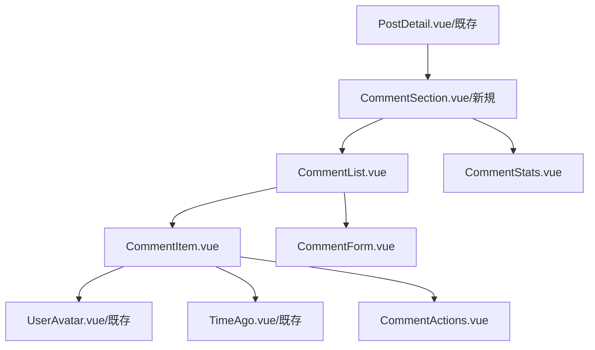

# Enhance Command - 機能追加・改善

## 概要
既存のVue.js + Supabaseシステムに新機能を追加したり、既存機能を改善する際の設計と実装計画を立案します。既存アーキテクチャとの整合性を保ちながら、段階的な統合を実現します。

## 使用方法
```
/enhance [機能の説明]
```

## 前提条件
- `/analyze` コマンドの実行結果が存在すること
- または既存システムの構成情報を手動で提供すること

## 実行プロセス

### 1. 既存システムとの整合性確認

#### 1.1 現在のアーキテクチャ分析
```javascript
// 既存システムの構成を読み込み
const loadExistingArchitecture = async () => {
  // 解析レポートが存在する場合
  const analysisReport = await readFile('.tmp/analysis_report.md')
  
  if (analysisReport) {
    return parseAnalysisReport(analysisReport)
  }
  
  // 手動で既存構成を確認
  return {
    vue: await detectVueVersion(),
    stateManagement: await detectStateManagement(),
    uiFramework: await detectUIFramework(),
    apiPattern: await detectAPIPattern(),
    authPattern: await detectAuthPattern()
  }
}

// 新機能との互換性チェック
const checkCompatibility = (existingArch, newFeature) => {
  const compatibility = {
    issues: [],
    warnings: [],
    recommendations: []
  }
  
  // Vue 2 と Vue 3 の機能差異
  if (existingArch.vue.version === '2' && newFeature.requires.vue3Features) {
    compatibility.issues.push({
      type: 'version-mismatch',
      message: 'この機能はVue 3の機能を必要とします',
      solution: 'Vue 3へのアップグレードを検討するか、代替実装を使用してください'
    })
  }
  
  // 状態管理の互換性
  if (existingArch.stateManagement === 'Vuex' && newFeature.statePattern === 'Pinia') {
    compatibility.warnings.push({
      type: 'state-management-mix',
      message: '異なる状態管理ライブラリの混在',
      solution: 'Vuexストアでのラッパー実装を推奨'
    })
  }
  
  return compatibility
}
```

### 2. 新機能の設計

#### 2.1 機能要件の明確化
```javascript
// ユーザー入力から機能要件を抽出
const extractFeatureRequirements = (userInput) => {
  return {
    // 基本情報
    name: extractFeatureName(userInput),
    description: userInput,
    type: classifyFeatureType(userInput), // 'ui', 'api', 'auth', 'data', 'integration'
    
    // 技術要件
    requires: {
      components: estimateRequiredComponents(userInput),
      stores: estimateRequiredStores(userInput),
      apis: estimateRequiredAPIs(userInput),
      database: estimateDatabaseChanges(userInput)
    },
    
    // 影響範囲
    impact: {
      existingComponents: [],
      existingStores: [],
      existingAPIs: [],
      databaseSchema: []
    }
  }
}

// コメント機能の例
const commentFeatureDesign = {
  name: 'コメントシステム',
  components: [
    {
      name: 'CommentList.vue',
      type: 'container',
      dependencies: ['CommentItem.vue', 'CommentForm.vue'],
      props: ['postId', 'allowReplies'],
      integration: 'PostDetail.vueに統合'
    },
    {
      name: 'CommentItem.vue',
      type: 'presentational',
      props: ['comment', 'onReply', 'onEdit', 'onDelete'],
      emits: ['reply', 'edit', 'delete']
    },
    {
      name: 'CommentForm.vue',
      type: 'form',
      props: ['parentId', 'editingComment'],
      emits: ['submit', 'cancel'],
      validation: true
    }
  ],
  stores: [
    {
      name: 'useCommentsStore',
      state: ['comments', 'loading', 'error'],
      actions: ['fetchComments', 'createComment', 'updateComment', 'deleteComment'],
      realtime: true
    }
  ],
  database: {
    tables: [
      {
        name: 'comments',
        columns: [
          'id uuid primary key default gen_random_uuid()',
          'post_id uuid references posts(id) on delete cascade',
          'user_id uuid references users(id) on delete cascade',
          'parent_id uuid references comments(id) on delete cascade',
          'content text not null',
          'is_edited boolean default false',
          'created_at timestamp with time zone default now()',
          'updated_at timestamp with time zone default now()'
        ],
        rls: [
          'CREATE POLICY "Comments are viewable by everyone" ON comments FOR SELECT USING (true)',
          'CREATE POLICY "Users can create comments" ON comments FOR INSERT TO authenticated WITH CHECK (auth.uid() = user_id)',
          'CREATE POLICY "Users can update own comments" ON comments FOR UPDATE USING (auth.uid() = user_id)',
          'CREATE POLICY "Users can delete own comments" ON comments FOR DELETE USING (auth.uid() = user_id)'
        ]
      }
    ]
  }
}
```

#### 2.2 既存パターンとの統合設計
```javascript
// 既存のコーディングパターンを踏襲
const alignWithExistingPatterns = (feature, existingPatterns) => {
  const aligned = { ...feature }
  
  // コンポーネント命名規則の適用
  if (existingPatterns.naming.components === 'PascalCase') {
    aligned.components = aligned.components.map(comp => ({
      ...comp,
      name: toPascalCase(comp.name)
    }))
  }
  
  // 既存のディレクトリ構造に合わせる
  aligned.fileStructure = {
    components: mapToExistingStructure(aligned.components, existingPatterns.directories.components),
    stores: mapToExistingStructure(aligned.stores, existingPatterns.directories.stores),
    composables: mapToExistingStructure(aligned.composables, existingPatterns.directories.composables)
  }
  
  // APIパターンの適用
  if (existingPatterns.api.style === 'repository') {
    aligned.api = generateRepositoryPattern(feature)
  } else if (existingPatterns.api.style === 'service') {
    aligned.api = generateServicePattern(feature)
  }
  
  return aligned
}
```

### 3. データベース拡張設計

#### 3.1 スキーマ変更の計画
```javascript
// 既存スキーマとの整合性確認
const planDatabaseChanges = async (feature, existingSchema) => {
  const changes = {
    newTables: [],
    alterTables: [],
    newIndexes: [],
    newPolicies: [],
    migrations: []
  }
  
  // 新しいテーブルの追加
  feature.database.tables.forEach(table => {
    if (!existingSchema.tables.includes(table.name)) {
      changes.newTables.push(table)
      
      // マイグレーションスクリプトの生成
      changes.migrations.push({
        version: generateMigrationVersion(),
        name: `create_${table.name}_table`,
        up: generateCreateTableSQL(table),
        down: `DROP TABLE IF EXISTS ${table.name};`
      })
    }
  })
  
  // 既存テーブルへの変更
  feature.database.alterations?.forEach(alteration => {
    changes.alterTables.push(alteration)
    
    changes.migrations.push({
      version: generateMigrationVersion(),
      name: `alter_${alteration.table}_add_${alteration.column}`,
      up: `ALTER TABLE ${alteration.table} ADD COLUMN ${alteration.column} ${alteration.type};`,
      down: `ALTER TABLE ${alteration.table} DROP COLUMN ${alteration.column};`
    })
  })
  
  return changes
}

// Supabase Migration の生成
const generateSupabaseMigration = (changes) => {
  return `
-- Migration: ${changes.version}
-- Description: ${changes.description}
-- Created: ${new Date().toISOString()}

-- UP Migration
${changes.migrations.map(m => m.up).join('\n\n')}

-- Create RLS Policies
${changes.newPolicies.map(p => p.sql).join('\n')}

-- Create Indexes
${changes.newIndexes.map(i => i.sql).join('\n')}

-- Down Migration (in separate file)
-- ${changes.migrations.map(m => m.down).join('\n-- ')}
  `.trim()
}
```

### 4. 段階的統合計画

#### 4.1 実装フェーズの設計
```javascript
// 段階的な実装計画を生成
const createPhasesPlan = (feature, dependencies) => {
  const phases = []
  
  // Phase 1: 基盤準備
  phases.push({
    phase: 1,
    name: '基盤準備',
    duration: '2-3日',
    tasks: [
      {
        task: 'データベーススキーマの更新',
        subtasks: [
          'マイグレーションファイルの作成',
          '開発環境での実行とテスト',
          'RLSポリシーの設定'
        ],
        risk: 'low',
        rollback: 'マイグレーションのロールバック'
      },
      {
        task: 'APIレイヤーの準備',
        subtasks: [
          'Supabaseクライアント関数の作成',
          'エラーハンドリングの実装',
          '型定義の追加'
        ],
        risk: 'low'
      }
    ]
  })
  
  // Phase 2: コア機能実装
  phases.push({
    phase: 2,
    name: 'コア機能実装',
    duration: '3-5日',
    tasks: [
      {
        task: 'Piniaストアの実装',
        subtasks: [
          '状態管理ロジックの実装',
          'アクションとゲッターの作成',
          '既存ストアとの連携'
        ],
        risk: 'medium',
        testing: 'ユニットテスト必須'
      },
      {
        task: 'コンポーネントの実装',
        subtasks: [
          '基本コンポーネントの作成',
          'Props/Emitsの定義',
          'スタイリング（DaisyUI適用）'
        ],
        risk: 'low'
      }
    ]
  })
  
  // Phase 3: 統合とテスト
  phases.push({
    phase: 3,
    name: '統合とテスト',
    duration: '2-3日',
    tasks: [
      {
        task: '既存機能との統合',
        subtasks: [
          '親コンポーネントへの組み込み',
          'ルーティングの更新',
          'ナビゲーションの更新'
        ],
        risk: 'high',
        testing: '統合テスト、E2Eテスト'
      },
      {
        task: 'リアルタイム機能の追加',
        subtasks: [
          'Supabaseリアルタイム購読',
          '状態の同期処理',
          'オフライン対応'
        ],
        risk: 'medium'
      }
    ]
  })
  
  // Phase 4: 最適化とデプロイ
  phases.push({
    phase: 4,
    name: '最適化とデプロイ',
    duration: '1-2日',
    tasks: [
      {
        task: 'パフォーマンス最適化',
        subtasks: [
          'コンポーネントの遅延読み込み',
          'クエリの最適化',
          'キャッシュ戦略の実装'
        ]
      },
      {
        task: '本番環境へのデプロイ',
        subtasks: [
          'ステージング環境でのテスト',
          'データベースマイグレーション',
          '段階的ロールアウト'
        ]
      }
    ]
  })
  
  return phases
}
```

### 5. 既存コンポーネントの再利用戦略

#### 5.1 再利用可能コンポーネントの特定
```javascript
// 既存コンポーネントの再利用分析
const analyzeReusableComponents = async (feature, existingComponents) => {
  const reusable = {
    direct: [],      // そのまま使える
    withProps: [],   // Props追加で使える
    withWrapper: [], // ラッパーが必要
    reference: []    // 参考にできる
  }
  
  // コメント機能の例
  const commentFeatureAnalysis = {
    direct: [
      {
        existing: 'UserAvatar.vue',
        usage: 'コメント投稿者のアバター表示',
        location: 'components/common/UserAvatar.vue'
      },
      {
        existing: 'TimeAgo.vue',
        usage: 'コメント投稿時刻の表示',
        location: 'components/common/TimeAgo.vue'
      },
      {
        existing: 'LoadingSpinner.vue',
        usage: 'コメント読み込み中の表示',
        location: 'components/common/LoadingSpinner.vue'
      }
    ],
    withProps: [
      {
        existing: 'ConfirmDialog.vue',
        usage: 'コメント削除確認',
        newProps: ['message', 'confirmText', 'cancelText'],
        location: 'components/common/ConfirmDialog.vue'
      }
    ],
    withWrapper: [
      {
        existing: 'MarkdownEditor.vue',
        usage: 'コメント編集エディター',
        wrapper: 'CommentEditor.vue',
        reason: 'コメント用の文字数制限とツールバーカスタマイズ'
      }
    ],
    reference: [
      {
        existing: 'PostForm.vue',
        usage: 'フォームバリデーションパターンの参考',
        patterns: ['バリデーション', 'エラー表示', '送信処理']
      }
    ]
  }
  
  return reusable
}
```

### 6. 実装コード生成

#### 6.1 Vueコンポーネントのテンプレート生成
```vue
<!-- 生成されるCommentList.vue -->
<template>
  <div class="comment-list">
    <!-- ヘッダー -->
    <div class="flex items-center justify-between mb-4">
      <h3 class="text-lg font-semibold">
        コメント ({{ comments.length }})
      </h3>
      
      <button
        v-if="!showForm"
        @click="showForm = true"
        class="btn btn-primary btn-sm"
      >
        <PlusIcon class="w-4 h-4 mr-1" />
        コメントを追加
      </button>
    </div>
    
    <!-- コメントフォーム -->
    <transition name="slide-down">
      <CommentForm
        v-if="showForm"
        @submit="handleCommentSubmit"
        @cancel="showForm = false"
        class="mb-6"
      />
    </transition>
    
    <!-- コメントリスト -->
    <div v-if="loading" class="flex justify-center py-8">
      <LoadingSpinner />
    </div>
    
    <div v-else-if="error" class="alert alert-error">
      {{ error }}
    </div>
    
    <div v-else-if="comments.length === 0" class="text-center py-8 text-gray-500">
      まだコメントがありません
    </div>
    
    <div v-else class="space-y-4">
      <CommentItem
        v-for="comment in comments"
        :key="comment.id"
        :comment="comment"
        :allow-replies="allowReplies"
        @reply="handleReply"
        @edit="handleEdit"
        @delete="handleDelete"
      />
    </div>
  </div>
</template>

<script setup>
import { ref, onMounted, onUnmounted } from 'vue'
import { useCommentsStore } from '@/stores/comments'
import CommentForm from './CommentForm.vue'
import CommentItem from './CommentItem.vue'
import LoadingSpinner from '@/components/common/LoadingSpinner.vue'
import { PlusIcon } from '@heroicons/vue/24/outline'

const props = defineProps({
  postId: {
    type: String,
    required: true
  },
  allowReplies: {
    type: Boolean,
    default: true
  }
})

const commentsStore = useCommentsStore()
const showForm = ref(false)

// リアクティブな参照
const comments = computed(() => commentsStore.getCommentsByPostId(props.postId))
const loading = computed(() => commentsStore.loading)
const error = computed(() => commentsStore.error)

// コメントの取得
onMounted(async () => {
  await commentsStore.fetchComments(props.postId)
  
  // リアルタイム購読
  commentsStore.subscribeToComments(props.postId)
})

// クリーンアップ
onUnmounted(() => {
  commentsStore.unsubscribeFromComments(props.postId)
})

// イベントハンドラー
const handleCommentSubmit = async (content) => {
  const success = await commentsStore.createComment({
    post_id: props.postId,
    content
  })
  
  if (success) {
    showForm.value = false
  }
}

const handleReply = (comment) => {
  // 返信処理
}

const handleEdit = (comment) => {
  // 編集処理
}

const handleDelete = async (comment) => {
  if (confirm('このコメントを削除しますか？')) {
    await commentsStore.deleteComment(comment.id)
  }
}
</script>

<style scoped>
/* Transition styles */
.slide-down-enter-active,
.slide-down-leave-active {
  transition: all 0.3s ease;
}

.slide-down-enter-from {
  transform: translateY(-20px);
  opacity: 0;
}

.slide-down-leave-to {
  transform: translateY(-20px);
  opacity: 0;
}
</style>
```

#### 6.2 Piniaストアのテンプレート生成
```javascript
// stores/comments.js
import { defineStore } from 'pinia'
import { ref, computed } from 'vue'
import { supabase } from '@/lib/supabase'

export const useCommentsStore = defineStore('comments', () => {
  // State
  const comments = ref([])
  const loading = ref(false)
  const error = ref(null)
  const subscriptions = ref(new Map())
  
  // Getters
  const getCommentsByPostId = computed(() => {
    return (postId) => comments.value.filter(c => c.post_id === postId)
  })
  
  const getCommentReplies = computed(() => {
    return (parentId) => comments.value.filter(c => c.parent_id === parentId)
  })
  
  // Actions
  const fetchComments = async (postId) => {
    loading.value = true
    error.value = null
    
    try {
      const { data, error: fetchError } = await supabase
        .from('comments')
        .select(`
          *,
          user:users(id, name, avatar_url),
          replies:comments(count)
        `)
        .eq('post_id', postId)
        .is('parent_id', null)
        .order('created_at', { ascending: true })
      
      if (fetchError) throw fetchError
      
      comments.value = data || []
    } catch (err) {
      error.value = err.message
      console.error('コメント取得エラー:', err)
    } finally {
      loading.value = false
    }
  }
  
  const createComment = async (commentData) => {
    try {
      const { data: { user } } = await supabase.auth.getUser()
      if (!user) throw new Error('認証が必要です')
      
      const { data, error: createError } = await supabase
        .from('comments')
        .insert({
          ...commentData,
          user_id: user.id
        })
        .select(`
          *,
          user:users(id, name, avatar_url)
        `)
        .single()
      
      if (createError) throw createError
      
      // 楽観的更新
      comments.value.push(data)
      
      return true
    } catch (err) {
      error.value = err.message
      return false
    }
  }
  
  const updateComment = async (commentId, content) => {
    try {
      const { data, error: updateError } = await supabase
        .from('comments')
        .update({ 
          content,
          is_edited: true,
          updated_at: new Date().toISOString()
        })
        .eq('id', commentId)
        .select()
        .single()
      
      if (updateError) throw updateError
      
      // ローカル状態の更新
      const index = comments.value.findIndex(c => c.id === commentId)
      if (index !== -1) {
        comments.value[index] = { ...comments.value[index], ...data }
      }
      
      return true
    } catch (err) {
      error.value = err.message
      return false
    }
  }
  
  const deleteComment = async (commentId) => {
    try {
      const { error: deleteError } = await supabase
        .from('comments')
        .delete()
        .eq('id', commentId)
      
      if (deleteError) throw deleteError
      
      // ローカル状態から削除
      comments.value = comments.value.filter(c => c.id !== commentId)
      
      return true
    } catch (err) {
      error.value = err.message
      return false
    }
  }
  
  // Realtime
  const subscribeToComments = (postId) => {
    const channel = supabase
      .channel(`comments:${postId}`)
      .on(
        'postgres_changes',
        {
          event: '*',
          schema: 'public',
          table: 'comments',
          filter: `post_id=eq.${postId}`
        },
        (payload) => {
          handleRealtimeChange(payload)
        }
      )
      .subscribe()
    
    subscriptions.value.set(postId, channel)
  }
  
  const unsubscribeFromComments = (postId) => {
    const channel = subscriptions.value.get(postId)
    if (channel) {
      supabase.removeChannel(channel)
      subscriptions.value.delete(postId)
    }
  }
  
  const handleRealtimeChange = (payload) => {
    const { eventType, new: newRecord, old: oldRecord } = payload
    
    switch (eventType) {
      case 'INSERT':
        // 重複チェック
        if (!comments.value.find(c => c.id === newRecord.id)) {
          comments.value.push(newRecord)
        }
        break
        
      case 'UPDATE':
        const index = comments.value.findIndex(c => c.id === newRecord.id)
        if (index !== -1) {
          comments.value[index] = newRecord
        }
        break
        
      case 'DELETE':
        comments.value = comments.value.filter(c => c.id !== oldRecord.id)
        break
    }
  }
  
  return {
    // State
    comments,
    loading,
    error,
    
    // Getters
    getCommentsByPostId,
    getCommentReplies,
    
    // Actions
    fetchComments,
    createComment,
    updateComment,
    deleteComment,
    
    // Realtime
    subscribeToComments,
    unsubscribeFromComments
  }
})
```

## 出力形式

### 機能拡張設計書（.tmp/enhancement_design.md）
```markdown
# 機能拡張設計書

## 概要
- **機能名**: コメントシステム
- **説明**: 記事にコメント機能を追加し、ユーザー間のディスカッションを可能にする
- **影響範囲**: 低〜中（既存機能への影響は限定的）
- **推定工期**: 8-13日

## 1. 既存システムとの整合性

### 現在のアーキテクチャ
- Vue.js: 3.4（Composition API 85%）
- 状態管理: Pinia
- UIフレームワーク: Tailwind CSS + DaisyUI
- バックエンド: Supabase

### 互換性評価
✅ 完全互換: 既存アーキテクチャと完全に互換性があります
⚠️ 注意事項:
- 既存の投稿（posts）テーブルとの外部キー制約
- 認証システムとの連携が必要

## 2. 技術設計

### コンポーネント構成


### データフロー
[データフロー図]

## 3. データベース設計

### 新規テーブル
```sql
-- comments テーブル
CREATE TABLE comments (
  id uuid PRIMARY KEY DEFAULT gen_random_uuid(),
  post_id uuid REFERENCES posts(id) ON DELETE CASCADE,
  user_id uuid REFERENCES users(id) ON DELETE CASCADE,
  parent_id uuid REFERENCES comments(id) ON DELETE CASCADE,
  content text NOT NULL CHECK (char_length(content) <= 1000),
  is_edited boolean DEFAULT false,
  created_at timestamp with time zone DEFAULT now(),
  updated_at timestamp with time zone DEFAULT now(),
  
  -- インデックス
  INDEX idx_comments_post_id (post_id),
  INDEX idx_comments_user_id (user_id),
  INDEX idx_comments_parent_id (parent_id),
  INDEX idx_comments_created_at (created_at DESC)
);

-- RLSポリシー
[RLSポリシー定義]
```

### 既存テーブルへの変更
```sql
-- posts テーブルに集計カラムを追加（オプション）
ALTER TABLE posts ADD COLUMN comment_count integer DEFAULT 0;

-- トリガーで自動更新
CREATE FUNCTION update_post_comment_count() ...
```

## 4. 実装計画

### Phase 1: 基盤準備（2-3日）
- [ ] データベーススキーマの作成
- [ ] Supabase マイグレーション実行
- [ ] API層の実装（commentsApi）
- [ ] 型定義の追加

### Phase 2: コア機能実装（3-5日）
- [ ] Pinia ストア実装（useCommentsStore）
- [ ] 基本コンポーネント作成
  - [ ] CommentList.vue
  - [ ] CommentItem.vue
  - [ ] CommentForm.vue
- [ ] バリデーション実装

### Phase 3: 統合とテスト（2-3日）
- [ ] PostDetail.vueへの統合
- [ ] リアルタイム機能の実装
- [ ] エラーハンドリング
- [ ] 単体テスト作成

### Phase 4: 最適化とデプロイ（1-2日）
- [ ] パフォーマンス最適化
- [ ] E2Eテスト
- [ ] 本番環境デプロイ

## 5. 既存資産の活用

### 再利用可能コンポーネント
1. **UserAvatar.vue**: そのまま使用可能
2. **TimeAgo.vue**: そのまま使用可能
3. **LoadingSpinner.vue**: そのまま使用可能
4. **ConfirmDialog.vue**: Props追加で使用可能
5. **MarkdownEditor.vue**: ラッパー作成で使用可能

### 参考にできるパターン
- PostForm.vueのバリデーションパターン
- PostsStoreのリアルタイム実装
- 既存のエラーハンドリングパターン

## 6. リスク評価と対策

### 技術的リスク
| リスク | 可能性 | 影響度 | 対策 |
|--------|--------|--------|------|
| パフォーマンス低下 | 中 | 中 | ページネーション実装、インデックス最適化 |
| リアルタイム同期の競合 | 低 | 高 | 楽観的UIとconflict resolution |
| 大量コメントの処理 | 中 | 中 | 仮想スクロール実装 |

### ビジネスリスク
| リスク | 可能性 | 影響度 | 対策 |
|--------|--------|--------|------|
| スパムコメント | 高 | 中 | モデレーション機能、レート制限 |
| 不適切なコンテンツ | 中 | 高 | 通報機能、自動フィルタリング |

## 7. テスト計画

### 単体テスト
- コンポーネントテスト（Vitest + Vue Test Utils）
- ストアテスト（Pinia testing）
- API層テスト（MSW）

### 統合テスト
- コメント作成フロー
- リアルタイム同期
- エラーケース

### E2Eテスト
- コメント投稿シナリオ
- 返信シナリオ
- 削除シナリオ

## 8. パフォーマンス考慮事項

### 最適化戦略
1. **遅延読み込み**: コメントセクションの遅延読み込み
2. **ページネーション**: 無限スクロール実装
3. **キャッシュ**: コメントデータのキャッシュ
4. **バッチ処理**: 複数の更新をバッチ化

### 目標指標
- 初期表示: < 1秒
- コメント投稿: < 500ms
- リアルタイム更新: < 100ms

## 9. セキュリティ考慮事項

### 実装必須項目
- [ ] XSS対策（コンテンツサニタイズ）
- [ ] SQLインジェクション対策（パラメータ化クエリ）
- [ ] レート制限（1分間に5コメントまで）
- [ ] 認証・認可の確認

## 10. 次のステップ

1. この設計書のレビューと承認
2. `/tasks` コマンドで詳細タスクに分解
3. 実装開始

### 推奨される追加機能
- いいね機能
- メンション機能（@ユーザー名）
- 通知システム連携
- Markdown対応
```

## TodoWrite連携

機能拡張の計画タスクを自動生成：

```javascript
const enhancementTasks = [
  {
    id: 'enhance-001',
    content: '既存システム分析と互換性確認',
    status: 'completed',
    priority: 'high'
  },
  {
    id: 'enhance-002',
    content: '機能要件の詳細設計',
    status: 'in_progress',
    priority: 'high'
  },
  {
    id: 'enhance-003',
    content: 'データベース設計とマイグレーション計画',
    status: 'pending',
    priority: 'high'
  },
  {
    id: 'enhance-004',
    content: 'コンポーネント設計と再利用分析',
    status: 'pending',
    priority: 'medium'
  },
  {
    id: 'enhance-005',
    content: '実装フェーズ計画',
    status: 'pending',
    priority: 'medium'
  },
  {
    id: 'enhance-006',
    content: 'テスト計画とリスク評価',
    status: 'pending',
    priority: 'medium'
  }
]
```

## まとめ

このコマンドは既存システムに新機能を安全に追加するための包括的な設計を提供します：

1. **整合性重視**: 既存アーキテクチャとの完全な互換性
2. **段階的統合**: リスクを最小化した実装計画
3. **資産活用**: 既存コンポーネントの最大限の再利用
4. **品質保証**: 包括的なテスト計画とリスク管理

設計承認後は `/tasks` コマンドで詳細なタスクに分解し、実装を開始できます。