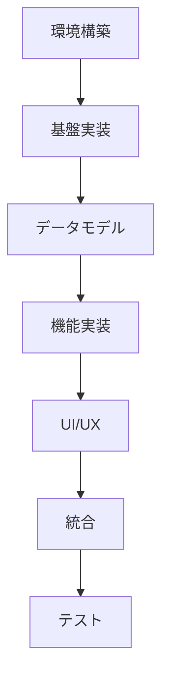

# Tasks Command - 詳細タスク分割

## 概要
技術設計を基に、実装可能な粒度まで詳細にタスクを分割します。各タスクは30分〜2時間で完了できる単位に分解します。

## 使用方法
```
/tasks
```

## 前提条件
- `/design` コマンドの実行が完了していること
- 技術設計書が承認されていること

## タスク分割基準

### 1. タスクサイズ
- **最小**: 30分（簡単な修正、設定変更）
- **標準**: 1時間（単一コンポーネント実装）
- **最大**: 2時間（複雑な機能実装）

### 2. タスク粒度の例

#### 2.1 コンポーネント実装（1時間）
```
Task: UserProfileCard コンポーネントの実装
- Props 定義とJSDoc型作成（15分）
- テンプレート実装（20分）
- スタイリング（DaisyUI適用）（15分）
- 単体テスト作成（10分）
```

#### 2.2 Supabase テーブル作成（30分）
```
Task: users テーブルの作成
- テーブル定義SQL作成（10分）
- RLSポリシー設定（10分）
- インデックス設定（5分）
- マイグレーション実行（5分）
```

## タスク分類

### 1. 環境構築タスク
```yaml
環境構築:
  - プロジェクト初期化:
      - Vue 3 + Vite セットアップ（30分）
      - JSDoc 設定（30分）
      - ESLint + Prettier 設定（30分）
  - Supabase 設定:
      - プロジェクト作成（15分）
      - 環境変数設定（15分）
      - クライアント初期化（30分）
  - UI フレームワーク:
      - Tailwind CSS インストール（15分）
      - DaisyUI 設定（15分）
      - テーマ設定（30分）
```

### 2. 基盤実装タスク
```yaml
基盤実装:
  - ルーティング:
      - Vue Router 設定（30分）
      - ルート定義（30分）
      - ナビゲーションガード（1時間）
  - 状態管理:
      - Pinia インストール（15分）
      - 基本ストア作成（30分）
      - 永続化設定（30分）
  - 認証基盤:
      - Supabase Auth 設定（30分）
      - 認証フロー実装（2時間）
      - セッション管理（1時間）
```

### 3. データモデルタスク
```yaml
データモデル:
  - データベース設計:
      - ERD 作成（1時間）
      - テーブル定義（各30分）
      - リレーション設定（各15分）
  - RLS ポリシー:
      - 基本ポリシー作成（各30分）
      - テスト作成（各30分）
  - 型定義:
      - TypeScript 型生成（30分）
      - Zod スキーマ作成（各30分）
```

### 4. 機能実装タスク
```yaml
機能実装:
  - ユーザー管理:
      - プロフィール表示（1時間）
      - プロフィール編集（2時間）
      - アバター上传（1時間）
  - CRUD 操作:
      - 一覧表示（1時間）
      - 詳細表示（30分）
      - 作成フォーム（2時間）
      - 編集フォーム（1.5時間）
      - 削除確認（30分）
```

### 5. UI/UX タスク
```yaml
UI/UX:
  - 共通コンポーネント:
      - ヘッダー（1時間）
      - フッター（30分）
      - サイドバー（1時間）
      - ナビゲーション（1時間）
  - フォーム部品:
      - 入力フィールド（各30分）
      - セレクトボックス（30分）
      - チェックボックス（30分）
      - ラジオボタン（30分）
  - フィードバック:
      - ローディング（30分）
      - エラー表示（30分）
      - 成功通知（30分）
      - 確認ダイアログ（30分）
```

### 6. 統合タスク
```yaml
統合:
  - API 連携:
      - Supabase クエリ実装（各30分）
      - エラーハンドリング（各30分）
      - キャッシュ戦略（1時間）
  - リアルタイム:
      - 購読設定（30分）
      - 更新処理（1時間）
      - 競合解決（1時間）
```

### 7. テストタスク
```yaml
テスト:
  - 単体テスト:
      - コンポーネント（各30分）
      - コンポーザブル（各30分）
      - ストア（各30分）
  - 統合テスト:
      - API 連携（各1時間）
      - 認証フロー（1時間）
  - E2E テスト:
      - 主要シナリオ（各1時間）
```

## タスク依存関係



## 見積もり計算

### 計算式
```
総工数 = Σ(タスク時間 × 難易度係数 × バッファ)

難易度係数:
- 簡単: 1.0
- 標準: 1.2
- 複雑: 1.5

バッファ: 1.3（30%のバッファ）
```

### 見積もり例
```
基本的なCRUDアプリケーション（5画面）:
- 環境構築: 4時間
- 基盤実装: 8時間
- データモデル: 6時間
- 機能実装: 20時間
- UI/UX: 12時間
- 統合: 8時間
- テスト: 10時間

合計: 68時間 × 1.3 = 88.4時間（約11人日）
```

## TodoWrite 自動生成

タスク分割完了後、以下の形式で TodoWrite に自動登録：

```typescript
const todos = [
  {
    id: "env-001",
    content: "Vue 3 + Vite プロジェクト初期化",
    status: "pending",
    priority: "high",
    estimated: "30m",
    category: "環境構築"
  },
  {
    id: "env-002",
    content: "TypeScript 設定",
    status: "pending",
    priority: "high",
    estimated: "30m",
    category: "環境構築",
    dependencies: ["env-001"]
  },
  // ... 全タスク
]
```

## 出力形式

1. `.cckiro/specs/[機能名]/tasks.md` - タスク一覧
2. `.cckiro/specs/[機能名]/timeline.md` - タイムライン
3. `.cckiro/specs/[機能名]/dependencies.md` - 依存関係図

## 進捗追跡

### 日次レポート
```markdown
## 2024-01-20 進捗

### 完了タスク（4/68）
- [x] Vue 3 + Vite プロジェクト初期化
- [x] TypeScript 設定
- [x] ESLint + Prettier 設定
- [x] Tailwind CSS インストール

### 進行中タスク（2）
- [ ] DaisyUI 設定（50%）
- [ ] Supabase プロジェクト作成（開始）

### 明日の予定
- DaisyUI 設定完了
- Supabase 環境構築完了
- Vue Router 設定開始

### 課題・リスク
- なし
```

## 次のステップ

タスク分割承認後、`/spec` コマンドで統合実装へ進む。