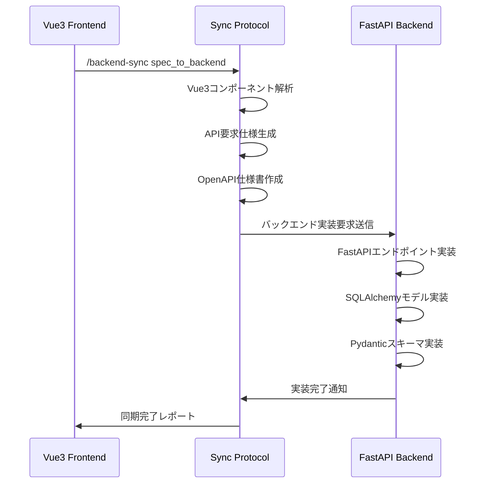
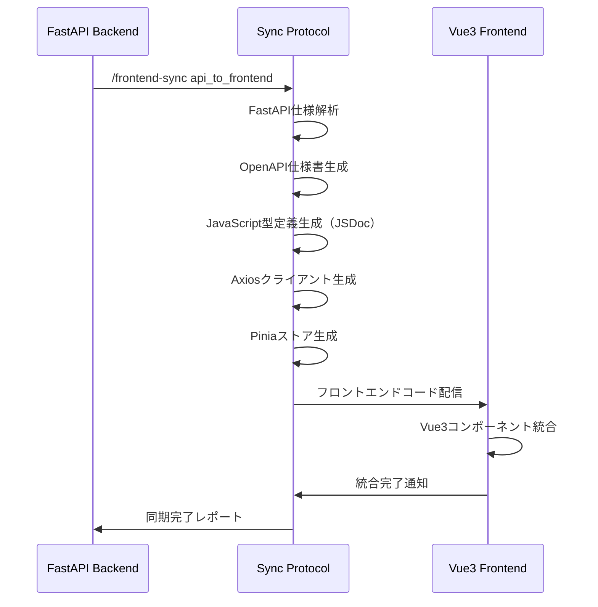
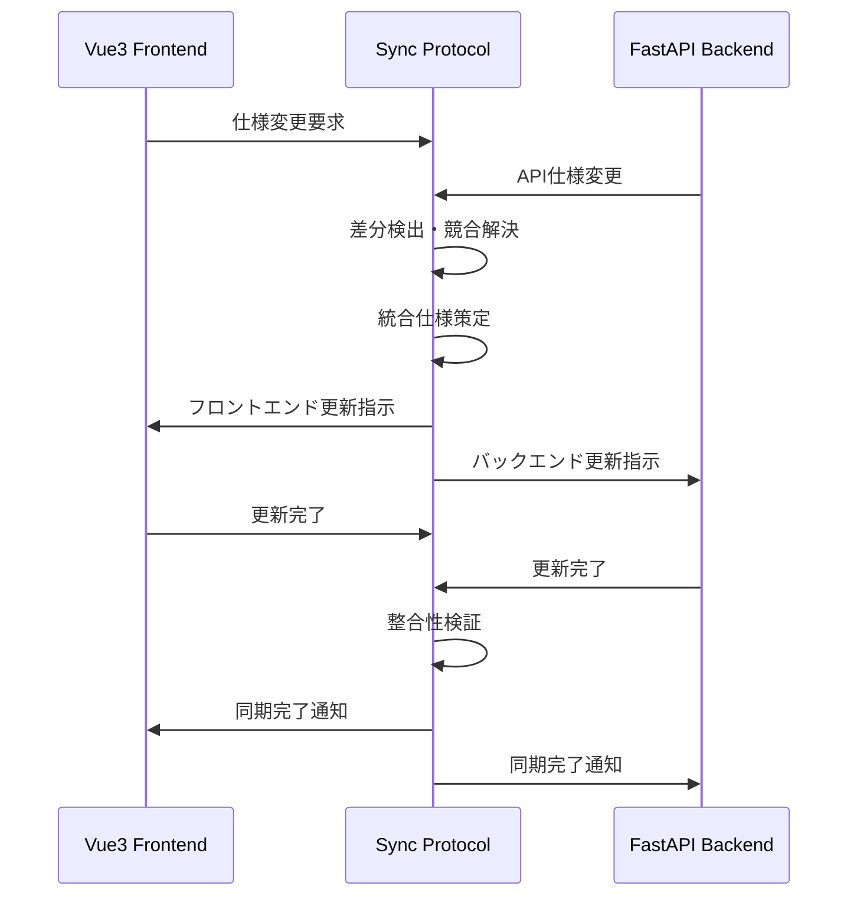

# フルスタック連携プロトコル仕様書

## 概要

Vue3 + Axios フロントエンドと FastAPI + SQLAlchemy バックエンド間の完全同期を実現するための共通プロトコル仕様です。

## プロトコル基本構造

### 1. 共有データフォーマット
```json
{
  "protocol_version": "1.0.0",
  "timestamp": "2024-01-15T12:00:00Z",
  "source_system": "vue3_frontend|fastapi_backend",
  "target_system": "fastapi_backend|vue3_frontend",
  "sync_type": "spec_to_backend|api_to_frontend|full_sync|validation_sync",
  "payload": {
    "metadata": {},
    "schemas": {},
    "endpoints": {},
    "validation_rules": {},
    "test_scenarios": {}
  }
}
```

### 2. API仕様同期フォーマット
```json
{
  "api_specification": {
    "openapi": "3.0.3",
    "info": {
      "title": "製造業品質管理システムAPI",
      "version": "1.0.0",
      "description": "フルスタック連携API仕様"
    },
    "servers": [
      {
        "url": "http://localhost:9995",
        "description": "開発環境"
      }
    ],
    "paths": {
      "/api/v1/auth/login": {
        "post": {
          "summary": "ユーザーログイン",
          "tags": ["authentication"],
          "requestBody": {
            "required": true,
            "content": {
              "application/json": {
                "schema": {
                  "$ref": "#/components/schemas/LoginRequest"
                }
              }
            }
          },
          "responses": {
            "200": {
              "description": "ログイン成功",
              "content": {
                "application/json": {
                  "schema": {
                    "$ref": "#/components/schemas/LoginResponse"
                  }
                }
              }
            },
            "401": {
              "description": "認証失敗",
              "content": {
                "application/json": {
                  "schema": {
                    "$ref": "#/components/schemas/ErrorResponse"
                  }
                }
              }
            }
          }
        }
      }
    },
    "components": {
      "schemas": {
        "LoginRequest": {
          "type": "object",
          "properties": {
            "username": {
              "type": "string",
              "minLength": 3,
              "maxLength": 50,
              "description": "ユーザー名"
            },
            "password": {
              "type": "string",
              "minLength": 8,
              "description": "パスワード"
            }
          },
          "required": ["username", "password"]
        },
        "LoginResponse": {
          "type": "object",
          "properties": {
            "access_token": {
              "type": "string",
              "description": "JWTアクセストークン"
            },
            "token_type": {
              "type": "string",
              "enum": ["bearer"],
              "description": "トークンタイプ"
            },
            "expires_in": {
              "type": "integer",
              "description": "有効期限（秒）"
            },
            "user": {
              "$ref": "#/components/schemas/User"
            }
          },
          "required": ["access_token", "token_type", "expires_in", "user"]
        }
      },
      "securitySchemes": {
        "BearerAuth": {
          "type": "http",
          "scheme": "bearer",
          "bearerFormat": "JWT"
        }
      }
    },
    "security": [
      {
        "BearerAuth": []
      }
    ]
  }
}
```

### 3. バリデーション同期フォーマット
```json
{
  "validation_synchronization": {
    "entity_name": "Product",
    "backend_schema": {
      "pydantic_model": "ProductCreate",
      "fields": {
        "product_code": {
          "type": "str",
          "constraints": {
            "min_length": 1,
            "max_length": 50,
            "pattern": "^[A-Z0-9-]+$"
          },
          "required": true,
          "error_messages": {
            "required": "製品コードは必須です",
            "min_length": "製品コードは1文字以上で入力してください",
            "max_length": "製品コードは50文字以内で入力してください",
            "pattern": "製品コードは大文字英数字とハイフンのみ使用可能です"
          }
        },
        "product_name": {
          "type": "str",
          "constraints": {
            "min_length": 1,
            "max_length": 200
          },
          "required": true,
          "error_messages": {
            "required": "製品名は必須です",
            "min_length": "製品名は1文字以上で入力してください",
            "max_length": "製品名は200文字以内で入力してください"
          }
        },
        "price": {
          "type": "Decimal",
          "constraints": {
            "ge": 0,
            "decimal_places": 2
          },
          "required": false,
          "error_messages": {
            "ge": "価格は0以上で入力してください",
            "decimal_places": "価格は小数点以下2桁まで入力可能です"
          }
        }
      }
    },
    "frontend_validation": {
      "vue_component": "ProductForm",
      "validation_rules": {
        "product_code": [
          {
            "rule": "required",
            "message": "製品コードは必須です"
          },
          {
            "rule": "minLength",
            "value": 1,
            "message": "製品コードは1文字以上で入力してください"
          },
          {
            "rule": "maxLength",
            "value": 50,
            "message": "製品コードは50文字以内で入力してください"
          },
          {
            "rule": "pattern",
            "value": "^[A-Z0-9-]+$",
            "message": "製品コードは大文字英数字とハイフンのみ使用可能です"
          }
        ],
        "product_name": [
          {
            "rule": "required",
            "message": "製品名は必須です"
          },
          {
            "rule": "minLength",
            "value": 1,
            "message": "製品名は1文字以上で入力してください"
          },
          {
            "rule": "maxLength",
            "value": 200,
            "message": "製品名は200文字以内で入力してください"
          }
        ],
        "price": [
          {
            "rule": "min",
            "value": 0,
            "message": "価格は0以上で入力してください"
          },
          {
            "rule": "decimal",
            "precision": 2,
            "message": "価格は小数点以下2桁まで入力可能です"
          }
        ]
      }
    }
  }
}
```

### 4. 型定義同期フォーマット
```json
{
  "type_synchronization": {
    "backend_types": {
      "sqlalchemy_models": {
        "User": {
          "table_name": "users",
          "columns": {
            "id": {
              "type": "Integer",
              "primary_key": true,
              "autoincrement": true
            },
            "username": {
              "type": "String",
              "length": 50,
              "unique": true,
              "nullable": false
            },
            "full_name": {
              "type": "String",
              "length": 100,
              "nullable": false
            },
            "email": {
              "type": "String",
              "length": 100,
              "unique": true,
              "nullable": false
            },
            "role": {
              "type": "Enum",
              "values": ["admin", "manager", "operator", "viewer"],
              "nullable": false
            },
            "is_active": {
              "type": "Boolean",
              "default": true
            },
            "created_at": {
              "type": "DateTime",
              "default": "utcnow"
            }
          }
        }
      },
      "pydantic_schemas": {
        "UserResponse": {
          "fields": {
            "id": {
              "type": "int",
              "description": "ユーザーID"
            },
            "username": {
              "type": "str",
              "description": "ユーザー名"
            },
            "full_name": {
              "type": "str",
              "description": "フルネーム"
            },
            "email": {
              "type": "str",
              "description": "メールアドレス"
            },
            "role": {
              "type": "str",
              "enum": ["admin", "manager", "operator", "viewer"],
              "description": "ユーザーロール"
            },
            "is_active": {
              "type": "bool",
              "description": "有効フラグ"
            },
            "created_at": {
              "type": "datetime",
              "description": "作成日時"
            }
          }
        }
      }
    },
    "frontend_types": {
      "jsdoc_types": {
        "User": {
          "typedef": "@typedef {Object} User",
          "properties": {
            "id": {
              "type": "number",
              "description": "ユーザーID"
            },
            "username": {
              "type": "string",
              "description": "ユーザー名"
            },
            "full_name": {
              "type": "string",
              "description": "フルネーム"
            },
            "email": {
              "type": "string",
              "description": "メールアドレス"
            },
            "role": {
              "type": "'admin'|'manager'|'operator'|'viewer'",
              "description": "ユーザーロール"
            },
            "is_active": {
              "type": "boolean",
              "description": "有効フラグ"
            },
            "created_at": {
              "type": "string",
              "description": "作成日時（ISO 8601形式）"
            }
          },
          "required": ["id", "username", "full_name", "email", "role", "is_active", "created_at"]
        }
      },
      "vue_props": {
        "UserForm": {
          "props": {
            "user": {
              "type": "Object",
              "required": false,
              "default": "null",
              "validator": "value => value === null || (value.id && value.username)"
            },
            "readonly": {
              "type": "Boolean",
              "required": false,
              "default": false
            }
          }
        }
      }
    }
  }
}
```

### 5. テスト同期フォーマット
```json
{
  "test_synchronization": {
    "api_contract_tests": [
      {
        "name": "ユーザーログインAPI契約テスト",
        "endpoint": "POST /api/v1/auth/login",
        "test_cases": [
          {
            "scenario": "正常ログイン",
            "request": {
              "body": {
                "username": "testuser",
                "password": "testpass123"
              }
            },
            "expected_response": {
              "status": 200,
              "schema_validation": "LoginResponse",
              "required_fields": ["access_token", "token_type", "expires_in", "user"]
            }
          },
          {
            "scenario": "認証失敗",
            "request": {
              "body": {
                "username": "wronguser",
                "password": "wrongpass"
              }
            },
            "expected_response": {
              "status": 401,
              "schema_validation": "ErrorResponse"
            }
          }
        ]
      }
    ],
    "integration_tests": [
      {
        "name": "製品管理フルフロー統合テスト",
        "description": "製品の作成から削除までの完全統合テスト",
        "steps": [
          {
            "step": 1,
            "action": "login",
            "backend_endpoint": "POST /api/v1/auth/login",
            "frontend_action": "authStore.login(credentials)",
            "validation": "JWTトークンの取得と保存"
          },
          {
            "step": 2,
            "action": "create_product",
            "backend_endpoint": "POST /api/v1/products",
            "frontend_action": "productStore.createProduct(data)",
            "validation": "製品がDBに保存され、ストアに反映される"
          },
          {
            "step": 3,
            "action": "fetch_products",
            "backend_endpoint": "GET /api/v1/products",
            "frontend_action": "productStore.fetchProducts()",
            "validation": "作成した製品が一覧に表示される"
          },
          {
            "step": 4,
            "action": "update_product",
            "backend_endpoint": "PUT /api/v1/products/{id}",
            "frontend_action": "productStore.updateProduct(id, data)",
            "validation": "製品情報が更新される"
          },
          {
            "step": 5,
            "action": "delete_product",
            "backend_endpoint": "DELETE /api/v1/products/{id}",
            "frontend_action": "productStore.deleteProduct(id)",
            "validation": "製品が削除され、一覧から消える"
          }
        ]
      }
    ],
    "e2e_tests": [
      {
        "name": "製品管理E2Eテスト",
        "browser_actions": [
          {
            "action": "navigate",
            "url": "/login"
          },
          {
            "action": "fill",
            "selector": "[data-testid='username']",
            "value": "testuser"
          },
          {
            "action": "fill",
            "selector": "[data-testid='password']",
            "value": "testpass123"
          },
          {
            "action": "click",
            "selector": "[data-testid='login-button']"
          },
          {
            "action": "wait_for_url",
            "url": "/dashboard"
          },
          {
            "action": "navigate",
            "url": "/products"
          },
          {
            "action": "click",
            "selector": "[data-testid='create-product']"
          },
          {
            "action": "fill",
            "selector": "[data-testid='product-code']",
            "value": "TEST001"
          },
          {
            "action": "fill",
            "selector": "[data-testid='product-name']",
            "value": "テスト製品"
          },
          {
            "action": "click",
            "selector": "[data-testid='save-product']"
          },
          {
            "action": "expect_visible",
            "selector": "text='TEST001'"
          }
        ]
      }
    ]
  }
}
```

## 連携ワークフロー

### 1. フロントエンド→バックエンド連携フロー


### 2. バックエンド→フロントエンド連携フロー


### 3. 双方向同期フロー


## データ保存・管理

### 1. 共有データストレージ構造
```
.tmp/
├── fullstack_sync/
│   ├── protocol_data/
│   │   ├── api_specifications/
│   │   │   ├── openapi_spec_[timestamp].json
│   │   │   └── schema_history.json
│   │   ├── type_definitions/
│   │   │   ├── javascript_types_[timestamp].js
│   │   │   └── pydantic_schemas_[timestamp].py
│   │   ├── validation_rules/
│   │   │   ├── frontend_validation_[timestamp].json
│   │   │   └── backend_validation_[timestamp].json
│   │   └── test_scenarios/
│   │       ├── api_contract_tests_[timestamp].json
│   │       └── e2e_scenarios_[timestamp].json
│   ├── sync_logs/
│   │   ├── sync_history.log
│   │   └── error_reports/
│   └── generated_code/
│       ├── frontend/
│       │   ├── types/
│       │   ├── services/
│       │   ├── stores/
│       │   └── components/
│       └── backend/
│           ├── models/
│           ├── schemas/
│           ├── routes/
│           └── tests/
```

### 2. バージョン管理
```json
{
  "protocol_version": "1.0.0",
  "sync_history": [
    {
      "sync_id": "sync_001",
      "timestamp": "2024-01-15T12:00:00Z",
      "sync_type": "spec_to_backend",
      "changes": [
        {
          "type": "schema_added",
          "entity": "Product",
          "details": "新規製品スキーマ追加"
        },
        {
          "type": "endpoint_added",
          "path": "/api/v1/products",
          "method": "POST",
          "details": "製品作成エンドポイント追加"
        }
      ],
      "affected_files": [
        "openapi_spec.json",
        "Product.vue",
        "productStore.js",
        "apiClient.js"
      ]
    }
  ],
  "rollback_points": [
    {
      "rollback_id": "rb_001",
      "timestamp": "2024-01-15T11:00:00Z",
      "description": "製品スキーマ追加前の安定版"
    }
  ]
}
```

## エラーハンドリング・ロールバック

### 1. 同期エラー分類
```json
{
  "error_categories": {
    "schema_conflict": {
      "description": "スキーマ定義の競合",
      "severity": "high",
      "resolution": "手動調整が必要"
    },
    "validation_mismatch": {
      "description": "バリデーションルールの不整合",
      "severity": "medium",
      "resolution": "自動調整可能"
    },
    "type_conversion_error": {
      "description": "型変換エラー",
      "severity": "high",
      "resolution": "型マッピング見直しが必要"
    },
    "dependency_missing": {
      "description": "依存関係の欠如",
      "severity": "low",
      "resolution": "自動補完可能"
    }
  }
}
```

### 2. ロールバック機能
```python
class SyncRollback:
    """同期ロールバック機能"""
    
    def create_rollback_point(self, description: str) -> str:
        """ロールバックポイント作成"""
        rollback_id = f"rb_{int(time.time())}"
        
        rollback_data = {
            "rollback_id": rollback_id,
            "timestamp": datetime.utcnow().isoformat(),
            "description": description,
            "snapshot": self.create_snapshot()
        }
        
        self.save_rollback_point(rollback_data)
        return rollback_id
    
    def rollback_to_point(self, rollback_id: str) -> bool:
        """指定ポイントへのロールバック"""
        try:
            rollback_data = self.load_rollback_point(rollback_id)
            self.restore_snapshot(rollback_data["snapshot"])
            return True
        except Exception as e:
            self.log_error(f"Rollback failed: {str(e)}")
            return False
    
    def create_snapshot(self) -> dict:
        """現在状態のスナップショット作成"""
        return {
            "openapi_spec": self.load_current_spec(),
            "frontend_types": self.load_frontend_types(),
            "backend_schemas": self.load_backend_schemas(),
            "validation_rules": self.load_validation_rules()
        }
```

## 監視・メトリクス

### 1. 同期品質メトリクス
```json
{
  "sync_quality_metrics": {
    "schema_consistency": {
      "score": 0.95,
      "details": "フロントエンド・バックエンドスキーマ一致率"
    },
    "type_safety": {
      "score": 0.98,
      "details": "JavaScript型エラー削減率（JSDoc検証）"
    },
    "validation_alignment": {
      "score": 0.92,
      "details": "バリデーションルール統一率"
    },
    "api_coverage": {
      "score": 0.88,
      "details": "API仕様網羅率"
    }
  }
}
```

### 2. パフォーマンスメトリクス
```json
{
  "performance_metrics": {
    "sync_duration": {
      "full_sync": "45.2s",
      "incremental_sync": "12.8s",
      "validation_sync": "8.3s"
    },
    "code_generation": {
      "javascript_types": "2.1s",
      "axios_client": "3.4s",
      "pinia_stores": "5.7s",
      "vue_components": "8.9s"
    },
    "file_sizes": {
      "openapi_spec": "125KB",
      "javascript_types": "45KB",
      "axios_client": "78KB",
      "generated_stores": "234KB"
    }
  }
}
```

このプロトコル仕様により、Vue3 + FastAPI間の完全同期・連携が実現されます。