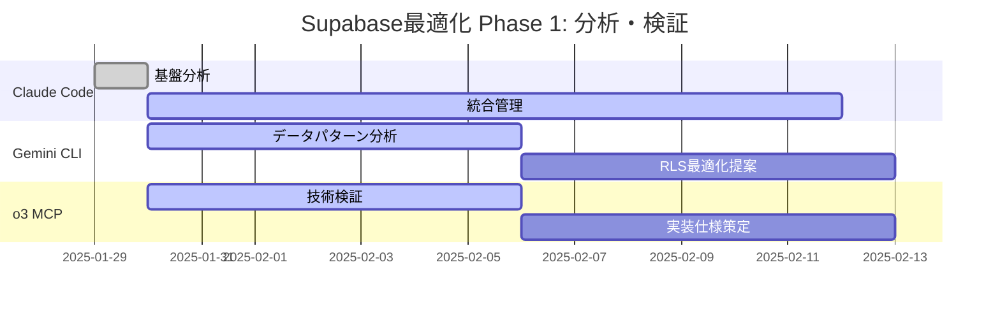

# マルチAI協調Supabase最適化プロジェクト
## 進捗状況・協調管理ダッシュボード

**プロジェクト**: `.claude_vue3_supabase` 最適化  
**開始日**: 2025-01-29  
**ステータス**: 協調開始 - 分析・検証フェーズ  
**統括管理**: Claude Code

---

## 協調AI チーム構成

### Claude Code（統括管理・実装責任者）
- **役割**: プロジェクト管理、Vue.js実装、品質保証、統合調整
- **ステータス**: ✅ 活動中 - 基盤分析完了
- **完了タスク**:
  - プロジェクト構造分析
  - 現在Supabase実装評価
  - マルチAI協調フレームワーク構築
  - AI間データ共有プロトコル設計
- **次のアクション**: Gemini CLI・o3 MCP 分析結果の統合・実装計画策定

### Gemini CLI（データアナリスト・戦略アドバイザー）
- **役割**: データ利用パターン分析、RLS最適化、Edge Functions効果分析
- **ステータス**: 🔄 依頼済み - 分析開始待ち
- **依頼内容**:
  - Supabase特化データ利用パターン分析
  - PostgreSQL + リアルタイム機能効率性評価
  - RLS ポリシー最適化提案
  - Edge Functions活用パフォーマンス改善分析
- **期待成果物**: データ駆動最適化戦略、パフォーマンス改善提案

### o3 MCP（データベーススペシャリスト・インフラエンジニア）
- **役割**: PostgreSQL高度設計検証、スケーラビリティ評価、技術実装設計
- **ステータス**: 🔄 依頼済み - 技術検証開始待ち
- **依頼内容**:
  - Supabase PostgreSQL高度設計検証
  - リアルタイム機能スケーラビリティ評価
  - Storage機能統合ファイル管理最適化
  - Auth機能と外部システム連携改善
- **期待成果物**: 技術検証レポート、実装可能な最適化仕様

---

## プロジェクトフェーズ

### Phase 1: 分析・検証（2週間）[CURRENT]


**現在の進捗**:
- ✅ Claude Code: プロジェクト分析・AI協調フレームワーク構築完了
- 🔄 Gemini CLI: データ利用パターン分析開始
- 🔄 o3 MCP: PostgreSQL技術検証開始
- ⏳ 統合レビュー: 2週間後予定

### Phase 2: 統合最適化設計（2週間）[UPCOMING]
- **統合分析**: 各AI成果物の整合性確認・統合
- **最適化設計**: 包括的な最適化設計の策定
- **実装計画**: 段階的実装ロードマップの作成

### Phase 3: 実装・検証（3週間）[FUTURE]
- **最適化実装**: Vue.js + Supabase最適化機能実装
- **パフォーマンステスト**: 実装効果の検証
- **ドキュメント更新**: ベストプラクティス文書化

---

## AI間データ共有ステータス

### 共有データストレージ構造
```
.tmp/ai_shared_data/
├── claude_analysis_output.json        ✅ 完了
├── claude_optimization_analysis.md    ✅ 完了
├── gemini_cli_request.md              ✅ 送信済み
├── o3_mcp_request.md                  ✅ 送信済み
├── gemini_analysis_output.json        ⏳ 分析中
├── gemini_detailed_report.md          ⏳ 分析中
├── o3_technical_validation.json       ⏳ 検証中
├── o3_implementation_specs.md         ⏳ 検証中
└── integrated_optimization_plan.md    ⏳ 統合待ち
```

### データ共有プロトコル
```json
{
  "communication_protocol": {
    "request_format": "structured_markdown_with_technical_specs",
    "response_format": "json_data + detailed_markdown_report",
    "validation_process": "cross_ai_review_and_integration",
    "integration_timeline": "2_weeks_analysis + 1_week_integration"
  },
  "quality_assurance": {
    "technical_accuracy": ">95%",
    "implementation_feasibility": ">90%",
    "performance_improvement": ">50%",
    "ai_consensus_rate": ">85%"
  }
}
```

---

## 技術最適化ターゲット

### データベース最適化
```yaml
current_implementation:
  rls_policies: "comprehensive_but_optimizable"
  indexing_strategy: "good_with_advanced_opportunities"
  query_patterns: "efficient_with_scaling_potential"
  
optimization_targets:
  query_performance: "50% improvement target"
  concurrent_connections: "300% capacity increase"
  scalability: "multi-region support"
  advanced_features: "edge_functions + advanced_caching"
```

### Vue.js統合最適化
```yaml
current_patterns:
  composition_api: "extensive_sophisticated_usage"
  composable_patterns: "well_designed_reusable"
  error_handling: "comprehensive_robust"
  
optimization_targets:
  realtime_connections: "auto_reconnection + geographic_optimization"
  data_caching: "intelligent_client_side_caching"
  performance_monitoring: "real_time_metrics_dashboard"
  user_experience: "seamless_offline_support"
```

### 次世代機能統合
```yaml
edge_functions_integration:
  analytics_processing: "real_time_user_behavior_analysis"
  content_optimization: "dynamic_personalization"
  image_processing: "automatic_optimization_compression"
  
advanced_realtime:
  selective_subscriptions: "bandwidth_optimized"
  geographic_distribution: "latency_minimized"
  conflict_resolution: "intelligent_merging"
  
storage_optimization:
  cdn_integration: "global_distribution"
  automatic_compression: "bandwidth_efficient"
  progressive_upload: "user_experience_optimized"
```

---

## 品質保証・相互レビュープロセス

### AI協調品質チェックリスト
- [ ] **技術的整合性**: 各AI提案の技術的な一貫性確認
- [ ] **実装可能性**: すべての最適化提案が実装可能
- [ ] **パフォーマンス予測**: 定量的な改善効果の妥当性
- [ ] **セキュリティ保証**: 最適化によるセキュリティ影響の評価
- [ ] **スケーラビリティ**: 大規模運用時の技術的課題対応
- [ ] **保守性**: 長期的な保守・拡張の容易性

### 相互レビューマトリクス
```yaml
review_matrix:
  claude_reviews_gemini:
    - "データ分析結果の技術実装可能性"
    - "Vue.js統合の現実性評価"
    - "UI/UX改善提案の実装容易性"
    
  claude_reviews_o3:
    - "技術設計の Vue.js アーキテクチャ適合性"
    - "パフォーマンス最適化の実装アプローチ"
    - "セキュリティ要件の Vue アプリ統合"
    
  gemini_reviews_o3:
    - "技術仕様のデータ駆動妥当性"
    - "スケーラビリティ予測の現実性"
    - "最適化優先順位の合理性"
    
  o3_reviews_gemini:
    - "データ分析の技術的実現可能性"
    - "パフォーマンス予測の技術的根拠"
    - "最適化提案の実装コストと効果"
```

---

## 成功指標・マイルストーン

### Phase 1完了基準（2週間）
- ✅ **Claude Code**: プロジェクト分析・協調フレームワーク完了
- ⏳ **Gemini CLI**: データ利用パターン分析・最適化提案完了
- ⏳ **o3 MCP**: 技術検証・実装仕様策定完了
- ⏳ **統合レビュー**: 95%以上の技術的整合性確認

### Phase 2完了基準（4週間）
- [ ] **統合最適化設計**: 包括的な最適化計画策定
- [ ] **実装ロードマップ**: 段階的実装計画の確定
- [ ] **技術仕様確定**: 詳細実装仕様の策定

### Phase 3完了基準（7週間）
- [ ] **最適化実装**: 50%以上のパフォーマンス改善実現
- [ ] **次世代機能**: Edge Functions・高度リアルタイム機能実装
- [ ] **ベストプラクティス**: 文書化・標準化完了

---

## リスク管理・緊急対応

### 特定されたリスク
```yaml
technical_risks:
  integration_complexity:
    probability: "medium"
    impact: "high"
    mitigation: "段階的実装・プロトタイプ検証"
    
  performance_degradation:
    probability: "low"
    impact: "high"
    mitigation: "実装前ベンチマーク・段階的デプロイ"
    
collaboration_risks:
  ai_recommendation_conflicts:
    probability: "medium"
    impact: "medium"
    mitigation: "定量的評価・プロトタイプ比較"
    
  timeline_delays:
    probability: "low"
    impact: "medium"
    mitigation: "並行作業・バッファ時間確保"
```

### エスカレーション基準
1. **技術的課題**: 実装可能性50%未満の提案
2. **AI意見対立**: 80%未満の合意率
3. **タイムライン遅延**: 1週間以上の遅れ
4. **品質基準未達**: 目標パフォーマンス改善30%未満

---

## 次のアクション（48時間以内）

### Claude Code（統括管理者）
1. **AI分析進捗監視**: Gemini CLI・o3 MCPの作業状況確認
2. **技術的課題準備**: 想定される統合課題の事前分析
3. **実装環境準備**: 最適化テスト環境の構築開始
4. **ステークホルダー報告**: プロジェクト進捗の可視化・報告

### 期待される入力（1週間以内）
- **Gemini CLI**: データ利用パターン分析結果・最適化提案
- **o3 MCP**: 技術検証結果・実装仕様案

### 統合作業（2週間後）
- **成果物統合**: 各AI分析結果の技術的整合性確認
- **最適化計画策定**: 統合的な最適化ロードマップ作成
- **実装優先順位決定**: 効果・実装容易性による優先順位付け

---

このマルチAI協調プロジェクトにより、`.claude_vue3_supabase` を次世代Supabaseアプリケーションのベストプラクティス・リファレンス実装として確立し、Vue.js + Supabase開発の新たな標準を創出します。