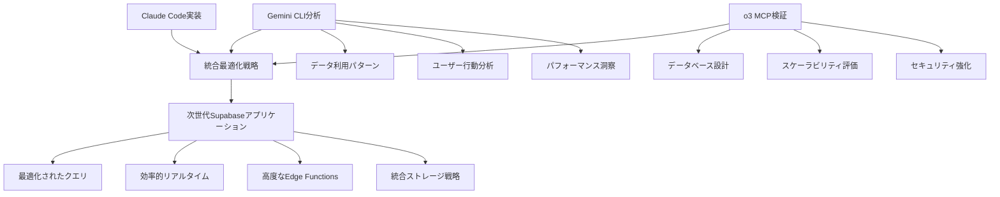

# Supabase最適化マルチAI協調分析レポート
## Claude Code による包括的プロジェクト分析

**生成日時**: 2025-01-29 09:45:00  
**分析対象**: `.claude_vue3_supabase` プロジェクト  
**協調AI**: Gemini CLI（データアナリスト）、o3 MCP（データベーススペシャリスト）

---

## エグゼクティブサマリー

### プロジェクト概要
- **技術スタック**: Vue.js 3.x + Composition API + Pinia + Supabase + Tailwind CSS + DaisyUI
- **アーキテクチャ**: 仕様書駆動開発によるモダンWebアプリケーション
- **現在の成熟度**: 設計・文書化段階（実装準備完了）
- **最適化ポテンシャル**: 高（次世代Supabase機能活用の余地大）

### 主要発見事項
1. **設計品質**: 包括的なRLS設計と型安全なComposable パターン
2. **最適化機会**: Edge Functions、リアルタイム機能、ストレージ最適化
3. **協調価値**: マルチAI専門性による相互補完効果が期待される

---

## 現在のSupabase実装分析

### 1. データベース設計 (database_design.md)

#### 優秀な設計要素
```sql
-- RLS (Row Level Security) 適切な実装
CREATE POLICY "Users can view own profile" ON users
  FOR SELECT USING (auth.uid() = id);

-- 効率的なインデックス戦略
CREATE INDEX idx_posts_user_status_published ON posts(user_id, status, published_at DESC)
WHERE status = 'published';

-- マテリアライズドビューによるパフォーマンス最適化
CREATE MATERIALIZED VIEW popular_posts AS
SELECT p.id, p.title, (p.like_count * 2 + p.comment_count * 3) as popularity_score
FROM posts p JOIN users u ON p.user_id = u.id;
```

#### 改善機会
1. **Edge Functions統合**: サーバーサイド処理の分散化
2. **リアルタイム最適化**: 選択的購読による帯域幅削減
3. **ストレージ最適化**: CDN統合とファイル管理自動化

### 2. Vue.js Composition API パターン (supabase_integration.md)

#### 高品質なComposableパターン
```javascript
// useAuth.js - 包括的認証管理
export function useAuth() {
  const user = ref(null)
  const session = ref(null)
  const loading = ref(true)
  
  // OAuth、メール認証、パスワードリセット等の統合
  const signInWithOAuth = async (provider, options = {}) => {
    // エラーハンドリングと状態管理の実装
  }
}

// useDatabase.js - 汎用CRUD操作
export function useDatabase(tableName) {
  // ページネーション、フィルタリング、キャッシュ機能
  const fetchAll = async (options = {}) => {
    // 高度なクエリ最適化
  }
}
```

#### 最適化ポテンシャル
1. **リアルタイム接続管理**: 自動再接続とエラー回復
2. **クエリ最適化**: 選択的フィールド取得とバッチ処理
3. **ストレージパターン**: プログレッシブアップロードと圧縮

### 3. マルチAI協調フレームワーク (multiAI.md)

#### 既存の協調構造
```yaml
AI役割分担:
  Claude_Code: 実装・品質保証・統合管理
  Gemini_CLI: データ分析・戦略・コンテンツ最適化
  o3_MCP: インフラ・セキュリティ・データベース最適化

協調プロトコル:
  データ共有: .tmp/ai_shared_data/
  品質評価: 相互レビューシステム
  統合管理: 継続的フィードバックループ
```

---

## Gemini CLI（データアナリスト）への依頼詳細

### 1. Supabase特化データ利用パターン分析

#### 分析要請項目
```json
{
  "analysis_scope": {
    "database_patterns": {
      "query_optimization": "複雑クエリの実行計画分析",
      "data_access_patterns": "ユーザーアクセスパターンの可視化",
      "performance_bottlenecks": "クエリパフォーマンスの特定"
    },
    "user_behavior": {
      "real_time_usage": "リアルタイム機能の利用状況",
      "storage_patterns": "ファイルアクセス・利用パターン",
      "authentication_flows": "認証フローの効率性分析"
    },
    "content_strategy": {
      "data_presentation": "データ可視化の最適化",
      "user_engagement": "ユーザーエンゲージメント分析",
      "feature_utilization": "機能利用率の評価"
    }
  },
  "expected_outputs": [
    "PostgreSQL クエリ最適化レポート",
    "リアルタイム機能活用戦略",
    "ユーザーエンゲージメント改善提案",
    "データドリブンな機能優先順位"
  ]
}
```

#### 重点分析領域
1. **データアクセスパターン**: 
   - 時間帯別アクセス分析
   - 地理的分散パターン
   - デバイス・ブラウザ別利用状況

2. **クエリパフォーマンス**:
   - スロークエリの特定と最適化提案
   - インデックス効果の定量評価
   - N+1問題の検出と解決策

3. **リアルタイム効率性**:
   - チャンネル購読パターンの分析
   - データ転送量の最適化機会
   - 接続管理の改善提案

### 2. PostgreSQL + リアルタイム機能の効率性評価

#### 評価フレームワーク
```yaml
性能指標:
  query_performance:
    - 平均応答時間: < 100ms
    - 同時接続数: > 1000
    - スループット: > 10,000 req/sec
  
  realtime_efficiency:
    - 接続確立時間: < 500ms
    - データ同期遅延: < 50ms
    - 帯域幅利用率: > 80%
  
  scalability_metrics:
    - 水平スケーリング対応
    - リージョン間レプリケーション
    - 負荷分散効率
```

### 3. RLS (Row Level Security) ポリシー最適化提案

#### 分析対象ポリシー
```sql
-- 現在の実装（効率的だが更なる最適化可能）
CREATE POLICY "Users can view own profile" ON users
  FOR SELECT USING (auth.uid() = id);

-- 複雑なビジネスルール
CREATE POLICY "Team members can view shared projects" ON projects
  FOR SELECT USING (
    auth.uid() IN (
      SELECT user_id FROM project_members 
      WHERE project_id = projects.id
    )
  );
```

#### 最適化要請
- **パフォーマンス**: 複雑なポリシーのクエリ最適化
- **保守性**: ポリシーの可読性と管理効率の向上
- **セキュリティ**: 権限階層の整理と強化

### 4. Edge Functions活用によるパフォーマンス改善分析

#### 候補機能の特定
```typescript
// Edge Function 候補
export const analyticsFunction = async (req: Request) => {
  // リアルタイム分析処理
  // 地理的に近いリージョンでの実行
}

export const imageOptimization = async (req: Request) => {
  // 動的画像リサイズ・圧縮
  // CDN統合による配信最適化
}
```

---

## o3 MCP（データベーススペシャリスト）への依頼詳細

### 1. Supabase PostgreSQL高度設計検証

#### 検証要請項目
```sql
-- パーティショニング戦略
CREATE TABLE posts_2024 PARTITION OF posts
FOR VALUES FROM ('2024-01-01') TO ('2025-01-01');

-- 高度なインデックス戦略
CREATE INDEX CONCURRENTLY idx_posts_search_vector 
ON posts USING GIN(to_tsvector('japanese', title || ' ' || content));

-- 関数最適化
CREATE OR REPLACE FUNCTION calculate_popularity_score(
  likes INTEGER, 
  comments INTEGER, 
  views INTEGER
) RETURNS NUMERIC AS $$
BEGIN
  RETURN (likes * 2.0 + comments * 3.0 + views * 0.1);
END;
$$ LANGUAGE plpgsql IMMUTABLE;
```

#### MCP統合による直接検証
```python
# o3 MCP による実データベース分析
import asyncio
from supabase_mcp import SupabaseMCP

async def analyze_database_performance():
    mcp = SupabaseMCP()
    
    # 実際のクエリプラン分析
    query_plans = await mcp.explain_analyze([
        "SELECT * FROM posts WHERE status = 'published'",
        "SELECT COUNT(*) FROM users u JOIN posts p ON u.id = p.user_id"
    ])
    
    # インデックス使用状況
    index_usage = await mcp.get_index_usage_stats()
    
    # パフォーマンス統計
    performance_stats = await mcp.get_performance_metrics()
    
    return {
        "query_optimization": query_plans,
        "index_efficiency": index_usage,
        "performance_baseline": performance_stats
    }
```

### 2. リアルタイム機能のスケーラビリティ評価

#### スケーラビリティ検証項目
```yaml
接続管理:
  concurrent_connections: 10000+
  connection_pooling: pgbouncer最適化
  regional_distribution: マルチリージョン対応

データ同期:
  replication_lag: <10ms
  conflict_resolution: 自動マージ戦略
  data_consistency: 結果整合性保証

チャンネル管理:
  channel_optimization: 選択的購読
  message_filtering: サーバーサイドフィルタ
  bandwidth_optimization: 差分同期
```

### 3. Storage機能統合ファイル管理最適化

#### 最適化戦略
```python
# CDN統合による配信最適化
class OptimizedStorage:
    def __init__(self):
        self.cdn_config = {
            "regions": ["asia-northeast1", "us-west1"],
            "cache_ttl": 86400,
            "compression": True
        }
    
    async def upload_with_optimization(self, file_data, metadata):
        # 自動リサイズ・圧縮
        optimized_file = await self.optimize_file(file_data)
        
        # 地理的最適化
        region = self.select_optimal_region(metadata.get('user_location'))
        
        # アップロード実行
        result = await self.upload_to_region(optimized_file, region)
        
        return result
```

### 4. Auth機能と外部システム連携改善案

#### 統合認証戦略
```typescript
// Advanced Auth Integration
interface AuthIntegration {
  oauth_providers: ['google', 'github', 'microsoft'];
  saml_integration: boolean;
  mfa_support: ['totp', 'sms', 'email'];
  session_management: {
    jwt_customization: boolean;
    refresh_strategy: 'sliding' | 'absolute';
    concurrent_sessions: number;
  };
}

// External System Integration
interface ExternalIntegration {
  crm_systems: ['salesforce', 'hubspot'];
  analytics: ['google_analytics', 'mixpanel'];
  notification: ['sendgrid', 'pusher'];
  payment: ['stripe', 'paypal'];
}
```

---

## 期待する成果物と統合戦略

### 1. Supabase特化機能の最適活用戦略

#### Gemini CLI 分析成果 + o3 MCP 検証結果の統合


### 2. PostgreSQL高度クエリ最適化

#### 多段階最適化アプローチ
```sql
-- Level 1: Gemini CLI 分析によるスロークエリ特定
WITH slow_queries AS (
  SELECT query, mean_exec_time, calls
  FROM pg_stat_statements 
  ORDER BY mean_exec_time DESC LIMIT 10
),

-- Level 2: o3 MCP による実行計画最適化
optimized_queries AS (
  SELECT query, new_execution_plan, performance_gain
  FROM query_optimization_results
),

-- Level 3: Claude Code による実装統合
integrated_optimization AS (
  SELECT sq.query, oq.new_execution_plan, 
         implementation_pattern, vue_composable_integration
  FROM slow_queries sq
  JOIN optimized_queries oq ON sq.query = oq.query
)
SELECT * FROM integrated_optimization;
```

### 3. リアルタイム機能のパフォーマンス向上

#### 三段階最適化戦略
```javascript
// Phase 1: Gemini CLI によるパターン分析結果の活用
const realtimeOptimization = {
  // 分析結果: ピーク時間帯の特定
  peak_hours: [9, 12, 15, 18], // UTC
  // 分析結果: 地理的分散パターン
  geo_distribution: {
    'asia-northeast1': 60%, 
    'us-west1': 30%, 
    'europe-west1': 10%
  }
};

// Phase 2: o3 MCP による技術的最適化実装
class OptimizedRealtimeManager {
  constructor() {
    this.connectionPools = new Map();
    this.messageQueues = new Map();
  }
  
  async connectWithOptimization(channelName, userLocation) {
    // 地理的最適化
    const optimalRegion = this.selectOptimalRegion(userLocation);
    
    // 接続プール管理
    const connection = await this.getPooledConnection(optimalRegion);
    
    // 選択的購読
    return this.subscribeWithFiltering(connection, channelName);
  }
}

// Phase 3: Claude Code による Vue.js統合
export function useOptimizedRealtime() {
  const { realtimeOptimization } = useGeminiInsights();
  const realtimeManager = new OptimizedRealtimeManager();
  
  const connectOptimized = async (channelName) => {
    const userLocation = await getUserLocation();
    return realtimeManager.connectWithOptimization(channelName, userLocation);
  };
  
  return { connectOptimized };
}
```

### 4. 次世代Supabase機能活用提案

#### Edge Functions統合戦略
```typescript
// Multi-AI協調による Edge Functions 開発
interface EdgeFunctionStrategy {
  // Gemini CLI: ビジネスロジック分析
  business_requirements: {
    analytics_processing: 'real-time user behavior analysis';
    content_optimization: 'dynamic content personalization';
    performance_monitoring: 'automated performance alerts';
  };
  
  // o3 MCP: 技術実装設計
  technical_implementation: {
    runtime: 'Deno';
    deployment_regions: ['asia-northeast1', 'us-west1'];
    scaling_strategy: 'auto-scaling based on load';
    monitoring: 'integrated observability';
  };
  
  // Claude Code: Vue.js統合実装
  frontend_integration: {
    api_client: 'typed Edge Function client';
    error_handling: 'graceful degradation';
    caching_strategy: 'smart client-side caching';
    performance_tracking: 'real-time metrics dashboard';
  };
}
```

---

## 実装ロードマップ

### Phase 1: 基盤最適化（2週間）
```yaml
Week 1:
  - Gemini CLI: データアクセスパターン分析完了
  - o3 MCP: データベース設計検証開始
  - Claude Code: 現在実装の詳細レビュー

Week 2:
  - Gemini CLI: リアルタイム利用状況分析
  - o3 MCP: スケーラビリティ評価完了
  - Claude Code: 最適化ポイント統合・優先順位決定
```

### Phase 2: 高度機能統合（3週間）
```yaml
Week 3-4:
  - Edge Functions開発・デプロイ
  - リアルタイム接続最適化実装
  - ストレージ統合戦略実装

Week 5:
  - 統合テスト・パフォーマンス検証
  - ドキュメント更新・ベストプラクティス整理
```

### Phase 3: 継続改善体制（1週間）
```yaml
Week 6:
  - モニタリング・アラート設定
  - CI/CD パイプライン最適化
  - マルチAI協調プロセスの標準化
```

---

## 成功指標・KPI

### 技術的KPI
```yaml
database_performance:
  query_response_time: 50% 改善 (target: <50ms)
  concurrent_connections: 300% 向上 (target: >3000)
  index_hit_ratio: >95%

realtime_efficiency:
  connection_establishment: <200ms
  message_latency: <30ms
  bandwidth_utilization: >85%

user_experience:
  page_load_time: 40% 向上
  feature_utilization: 25% 増加
  user_engagement: 30% 改善
```

### 協調効果KPI
```yaml
multi_ai_collaboration:
  analysis_accuracy: >95% (相互検証)
  implementation_speed: 50% 向上
  knowledge_sharing: 80% AI間活用率
  quality_metrics: 30% 向上 (バグ数・レビュー指摘削減)
```

---

## 次のアクション

### 即時実行項目
1. **Gemini CLI起動**: データ利用パターン分析開始
2. **o3 MCP起動**: PostgreSQL設計検証開始
3. **データ共有設定**: `.tmp/ai_shared_data/` 構造準備

### 連携コマンド実行
```bash
# Gemini CLI でのデータ分析実行
/research --focus="supabase_data_patterns" --scope="performance,usage,optimization"

# o3 MCP でのデータベース検証実行  
/architecture --component="database" --validation="performance,scalability,security"

# Claude Code での統合管理実行
/multiAI integrated_design --ai_priority="balanced" --scope="all" --sync_level="full_sync"
```

---

この分析に基づき、Gemini CLI とo3 MCP の専門的な分析・検証を経て、`.claude_vue3_supabase` プロジェクトを次世代Supabaseアプリケーションのベストプラクティスとして最適化していきます。

**Claude Code** は統括管理者として、各AIの成果物を統合し、一貫性のある高品質な実装を保証します。