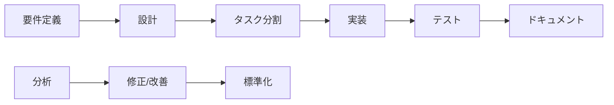

# 仕様書駆動開発システム by Claude Code

Vue.js + Supabaseを使用したWebアプリケーション開発のための、体系的な仕様書駆動開発フレームワークです。

## 🎯 概要

このプロジェクトは、Claude Codeを活用してWebアプリケーション開発を効率化するための包括的な開発システムです。要件定義から実装、保守まで、開発ライフサイクル全体をカバーする10個のカスタムコマンドと、プロジェクトテンプレートを提供します。

## 🚀 特徴

- **仕様書駆動開発**: 実装前に明確な仕様書作成を強制し、品質を担保
- **体系的なワークフロー**: 要件定義→設計→タスク分割→実装の4段階プロセス
- **Vue.js + Supabase特化**: モダンな技術スタックに最適化
- **自動化とAI支援**: Claude Codeとの統合により、高品質なコード生成を実現
- **包括的なドキュメント**: プロジェクトテンプレートとベストプラクティスを網羅

## 📋 技術スタック

### フロントエンド
- **フレームワーク**: Vue.js 3.x (Composition API)
- **状態管理**: Pinia
- **ルーティング**: Vue Router
- **スタイリング**: Tailwind CSS + DaisyUI
- **ビルドツール**: Vite

### バックエンド・インフラ
- **データベース**: Supabase (PostgreSQL)
- **認証**: Supabase Auth
- **ストレージ**: Supabase Storage
- **リアルタイム**: Supabase Realtime

## 🛠️ カスタムコマンド一覧

### 開発フロー管理
- `/spec` - 統合開発フロー管理（全フェーズのオーケストレーション）
- `/requirements` - 要件定義書の生成
- `/design` - 技術設計書の作成
- `/tasks` - タスク分割とTodo管理

### コード品質向上
- `/analyze` - プロジェクト分析とボトルネック検出
- `/enhance` - 新機能の追加・既存機能の改善
- `/fix` - バグ修正と問題解決
- `/refactor` - コードリファクタリング

### ドキュメント・標準化
- `/document` - 自動ドキュメント生成
- `/standardize` - コード標準化とベストプラクティス適用

## 📁 プロジェクト構造

```
.claude/
├── CLAUDE.md                    # Claude Code用プロジェクトガイド
├── commands/                    # カスタムコマンド定義
│   ├── spec.md                 # 統合開発フローコマンド
│   ├── requirements.md         # 要件定義コマンド
│   ├── design.md              # 設計コマンド
│   └── ...                    # その他のコマンド
├── 00_project/                 # プロジェクト概要テンプレート
│   ├── 01_project_concept.md   # プロジェクトコンセプト
│   └── 02_tech_stack_guidelines.md # 技術スタックガイドライン
├── 01_development_docs/        # 開発ドキュメント（予定）
├── 02_design_system/           # デザインシステム（予定）
└── 03_library_docs/            # ライブラリドキュメント（予定）
```

## 🚀 クイックスタート

### 1. リポジトリのクローン
```bash
git clone https://github.com/tfuruta1/specification_driven_system_development_by_claude_code.git
cd specification_driven_system_development_by_claude_code
```

### 2. Claude Codeでプロジェクトを開く
```bash
claude .
```

### 3. 開発フローの開始
```bash
# 完全な仕様書駆動開発フローを開始
/spec

# または個別のフェーズから開始
/requirements "タスク管理アプリを作成したい"
```

## 📖 使用方法

### 新規プロジェクトの開始

1. **要件定義**
   ```
   /requirements "作りたいアプリケーションの説明"
   ```

2. **設計書作成**
   ```
   /design
   ```

3. **タスク分割**
   ```
   /tasks
   ```

4. **実装**
   設計書に基づいてClaude Codeが実装を支援

### 既存プロジェクトの改善

1. **現状分析**
   ```
   /analyze
   ```

2. **問題修正**
   ```
   /fix "エラーメッセージまたは問題の説明"
   ```

3. **リファクタリング**
   ```
   /refactor
   ```

## 🎯 ワークフロー図



## 📝 プロジェクトテンプレート

このシステムは、Vue.js + Supabaseプロジェクト用の包括的なテンプレートを提供します：

- **プロジェクトコンセプト**: ビジョン、ターゲット、KPI定義
- **技術スタックガイドライン**: 技術選定理由、ベストプラクティス
- **アーキテクチャ設計**: システム構成、データフロー
- **開発ガイドライン**: コーディング規約、テスト戦略

## 🤝 貢献方法

1. このリポジトリをフォーク
2. 機能ブランチを作成 (`git checkout -b feature/amazing-feature`)
3. 変更をコミット (`git commit -m '素晴らしい機能を追加'`)
4. ブランチにプッシュ (`git push origin feature/amazing-feature`)
5. プルリクエストを作成

## 📄 ライセンス

このプロジェクトはMITライセンスの下で公開されています。

## 👥 作者

- GitHub: [@tfuruta1](https://github.com/tfuruta1)

## 🙏 謝辞

このプロジェクトは、Claude Code by Anthropicを活用して開発されています。

---

**注意**: このプロジェクトは現在開発中です。ドキュメントテンプレートの多くは今後追加される予定です。
