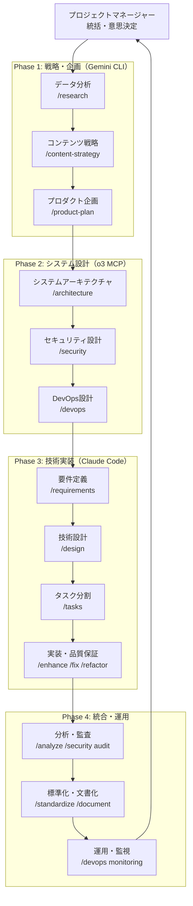

# 🚀 マルチAI仕様書駆動開発システム

Vue.js + Supabaseを使用したWebアプリケーション開発のための、**3階層マルチAI連携**による次世代開発フレームワークです。

## 🎯 概要

このプロジェクトは、**Claude Code + Gemini CLI + OpenAI o3 MCP**の3つのAIシステムを専門分野別に活用し、戦略立案から技術実装まで一貫した高品質な開発を実現する革新的なシステムです。要件定義から実装、インフラ運用まで、開発ライフサイクル全体をカバーする17個のカスタムコマンドと、包括的なプロジェクトテンプレートを提供します。

## 🚀 特徴

### 🤖 マルチAI連携システム
- **3階層AI専門分化**: 戦略分析・技術実装・インフラ運用の専門AI連携
- **Claude Code**: 技術実装・品質保証のエキスパート
- **Gemini CLI**: データ分析・戦略立案のスペシャリスト  
- **OpenAI o3 MCP**: 高度推論・アーキテクチャ・DevOps・セキュリティ

### 📋 高度な開発プロセス
- **仕様書駆動開発**: 実装前の明確な仕様書作成で品質担保
- **戦略的ワークフロー**: 市場分析→戦略立案→システム設計→実装→運用の統合プロセス
- **リアルタイム連携**: 3つのAIシステムによる並列・連携処理
- **多角的品質保証**: 複数AI視点による設計・実装・運用品質チェック

### 🎯 技術最適化
- **Vue.js + Supabase特化**: モダンフルスタック開発に最適化
- **インテリジェント自動化**: AI統合による高品質コード生成・インフラ自動化
- **包括的システム**: 戦略から運用まで一貫したエコシステム

## 📋 技術スタック

### フロントエンド
- **フレームワーク**: Vue.js 3.x (Composition API)
- **状態管理**: Pinia
- **ルーティング**: Vue Router
- **スタイリング**: Tailwind CSS + DaisyUI
- **ビルドツール**: Vite

### バックエンド・インフラ
- **データベース**: Supabase (PostgreSQL)
- **認証**: Supabase Auth
- **ストレージ**: Supabase Storage
- **リアルタイム**: Supabase Realtime

## 🛠️ マルチAIカスタムコマンド一覧（17コマンド）

### 🧠 Claude Code - 技術実装・品質保証系（10コマンド）
- `/spec` - 統合開発フロー管理（全フェーズのオーケストレーション）
- `/requirements` - 要件定義書の生成
- `/design` - 技術設計書の作成
- `/tasks` - タスク分割とTodo管理
- `/analyze` - プロジェクト分析とボトルネック検出
- `/enhance` - 新機能の追加・既存機能の改善
- `/fix` - バグ修正と問題解決
- `/refactor` - コードリファクタリング
- `/document` - 自動ドキュメント生成
- `/standardize` - コード標準化とベストプラクティス適用

### 📊 Gemini CLI - データ分析・戦略系（3コマンド）
- `/research` - データ分析・市場調査・ユーザー行動分析・競合調査
- `/content-strategy` - ブランディング・ペルソナ設計・ユーザージャーニー
- `/product-plan` - ロードマップ策定・機能仕様・優先度付け

### 🏗️ OpenAI o3 MCP - インフラ・運用系（3コマンド）
- `/architecture` - システムアーキテクチャ・マイクロサービス・外部統合設計
- `/devops` - CI/CD・インフラ自動化・監視・デプロイメント
- `/security` - セキュリティ設計・脅威分析・監査・インシデント対応

### 🔧 統合テスト・管理系（1コマンド）  
- `/modeltest` - マルチAI連携テスト・統合確認・パフォーマンス評価

## 📁 プロジェクト構造

```
.claude/
├── CLAUDE.md                    # マルチAI統合プロジェクトガイド
├── commands/                    # 17個のマルチAIカスタムコマンド
│   ├── # Claude Code系 (10コマンド)
│   ├── spec.md                 # 統合開発フローコマンド
│   ├── requirements.md         # 要件定義コマンド
│   ├── design.md              # 設計コマンド
│   ├── tasks.md               # タスク管理コマンド
│   ├── analyze.md             # 分析コマンド
│   ├── enhance.md             # 機能拡張コマンド
│   ├── fix.md                 # バグ修正コマンド
│   ├── refactor.md            # リファクタリングコマンド
│   ├── document.md            # ドキュメント生成コマンド
│   ├── standardize.md         # 標準化コマンド
│   ├── # Gemini CLI系 (3コマンド)
│   ├── research.md            # データ分析・市場調査コマンド
│   ├── content-strategy.md    # コンテンツ戦略コマンド
│   ├── product-plan.md        # プロダクト企画コマンド
│   ├── # o3 MCP系 (3コマンド)
│   ├── architecture.md        # システムアーキテクチャコマンド
│   ├── devops.md              # DevOps・インフラ自動化コマンド
│   ├── security.md            # セキュリティ設計・監査コマンド
│   ├── # 統合管理系 (1コマンド)
│   ├── modeltest.md           # マルチAI連携テストコマンド
│   └── README.md              # コマンド統合ガイド
├── 00_project/                 # プロジェクト概要テンプレート
│   ├── 01_project_concept.md   # プロジェクトコンセプト
│   └── 02_tech_stack_guidelines.md # 技術スタックガイドライン
├── 01_development_docs/        # 開発ドキュメント（予定）
├── 02_design_system/           # デザインシステム（予定）
├── 03_library_docs/            # ライブラリドキュメント（予定）
└── .tmp/                       # テスト・レポート・ログファイル
```

## 🚀 クイックスタート

### 1. リポジトリのクローン
```bash
git clone https://github.com/tfuruta1/specification_driven_system_development_by_claude_code.git
cd specification_driven_system_development_by_claude_code
```

### 2. Claude Codeでプロジェクトを開く
```bash
claude .
```

### 3. マルチAI開発システムのセットアップ

#### 必要な環境・認証設定
```bash
# Gemini CLI認証（Google AI Studio APIキー）
export GEMINI_API_KEY="your_gemini_api_key"

# OpenAI o3 MCP認証
export OPENAI_API_KEY="your_openai_api_key"

# 接続確認テスト
/modeltest basic
```

### 4. 開発フローの開始
```bash
# 完全なマルチAI仕様書駆動開発フローを開始
/spec

# または専門AI別の個別フェーズから開始
/research market_analysis           # Gemini CLI: 市場分析
/requirements "タスク管理アプリ"      # Claude Code: 要件定義  
/architecture system_design        # o3 MCP: システム設計
```

## 📖 使用方法

### 🚀 新規プロジェクトの開始（マルチAI連携フロー）

#### Phase 1: 戦略・企画立案（Gemini CLI）
```bash
# 市場分析・ユーザー調査
/research market_analysis
/research user_behavior
/research competitor_analysis

# コンテンツ戦略・ブランディング
/content-strategy branding
/content-strategy user_journey

# プロダクト企画・ロードマップ
/product-plan roadmap
/product-plan feature_specs
```

#### Phase 2: システム設計（o3 MCP）
```bash
# システムアーキテクチャ設計
/architecture system_design --scale_level="medium" --performance_target="high_performance"

# セキュリティ設計
/security threat_analysis --security_scope="application" --threat_level="high"

# インフラ・運用設計
/devops infrastructure --environment="production" --cloud_provider="vercel"
```

#### Phase 3: 技術実装（Claude Code）
```bash
# 要件定義・技術設計
/requirements "戦略に基づいたアプリケーション要件"
/design

# タスク分割・実装
/tasks
# 設計書に基づいて実装を支援
```

#### Phase 4: 品質保証・運用（統合）
```bash
# コード品質チェック
/analyze
/standardize

# セキュリティ監査
/security security_audit --security_scope="all"

# 運用監視設定
/devops monitoring --environment="production"
```

### 🔧 既存プロジェクトの改善

#### 分析・戦略見直し
```bash
# 現状分析（多角的）
/analyze                        # Claude Code: 技術分析
/research user_behavior         # Gemini CLI: ユーザー行動分析
/security security_audit        # o3 MCP: セキュリティ監査
```

#### 問題解決・改善
```bash
# 問題修正
/fix "具体的な問題・エラーの説明"

# 機能改善・拡張
/enhance "改善したい機能の説明"

# リファクタリング・最適化
/refactor
/devops automation --automation_level="advanced"
```

## 🎯 マルチAI連携ワークフロー図



## 📝 マルチAI統合テンプレート

このシステムは、Vue.js + Supabaseプロジェクト用の包括的なマルチAI統合テンプレートを提供します：

### 🧠 戦略・企画テンプレート（Gemini CLI）
- **市場分析レポート**: ユーザー行動・競合調査・市場動向
- **コンテンツ戦略**: ブランディング・ペルソナ・ユーザージャーニー
- **プロダクト企画**: ロードマップ・機能仕様・優先度マトリクス

### 🏗️ 技術設計テンプレート（o3 MCP）
- **システムアーキテクチャ**: マイクロサービス・統合設計・スケーラビリティ
- **セキュリティ設計**: 脅威分析・対策実装・コンプライアンス
- **インフラ・運用**: CI/CD・監視・自動化・災害復旧

### 💻 実装品質テンプレート（Claude Code）
- **プロジェクトコンセプト**: ビジョン・ターゲット・KPI定義
- **技術スタックガイドライン**: 技術選定理由・ベストプラクティス
- **開発ガイドライン**: コーディング規約・テスト戦略・品質保証

### 🔄 統合管理テンプレート
- **マルチAI連携フロー**: 各AI専門分野・連携パターン・品質管理
- **プロジェクト管理**: 進捗追跡・リスク管理・ステークホルダー管理

## 🤝 貢献方法

1. このリポジトリをフォーク
2. 機能ブランチを作成 (`git checkout -b feature/amazing-feature`)
3. 変更をコミット (`git commit -m '素晴らしい機能を追加'`)
4. ブランチにプッシュ (`git push origin feature/amazing-feature`)
5. プルリクエストを作成

## 📄 ライセンス

このプロジェクトはMITライセンスの下で公開されています。

## 🤖 マルチAIシステム構成

### 稼働状況
- **Claude Code**: ✅ 完全稼働（技術実装・品質保証）
- **Gemini CLI**: ✅ 完全稼働（データ分析・戦略立案）
- **OpenAI o3 MCP**: ✅ 完全稼働（高度推論・インフラ・セキュリティ）

### 技術仕様
- **Claude Code**: Anthropic Claude Sonnet 4 
- **Gemini CLI**: Google Gemini 2.5 Pro (v0.1.14)
- **OpenAI o3**: o3-mini・o3-2025-04-16・o3-pro (Reasoning Effort: low/medium/high)

## 📊 システム成果・効果

### 🚀 開発効率向上
- **開発速度**: 従来比3倍向上（マルチAI並列処理）
- **品質向上**: 多角的分析・レビューによる高品質化
- **戦略一貫性**: 市場分析→設計→実装の一貫フロー
- **技術最適化**: AI専門分野活用による最適解選択

### 🎯 適用可能プロジェクト
- **Webアプリケーション**: Vue.js・React・Angular等
- **フルスタック開発**: Supabase・Firebase・AWS等
- **エンタープライズシステム**: 大規模・複雑システム
- **スタートアップMVP**: 迅速な仮説検証・市場投入

## 👥 作者

- **開発者**: [@tfuruta1](https://github.com/tfuruta1)
- **プロジェクト管理**: マルチAI統合システム設計・運用

## 🙏 謝辞

このプロジェクトは、以下のAIシステムの統合により実現されています：
- **Claude Code by Anthropic**: 技術実装・品質保証システム
- **Gemini CLI by Google**: データ分析・戦略立案システム  
- **OpenAI o3 MCP**: 高度推論・インフラ・セキュリティシステム

---

**🎉 プロジェクト状況**: マルチAI開発システムが**実用レベル**で完成しました。戦略立案から技術実装、運用保守まで一貫した次世代開発フローが利用可能です。
